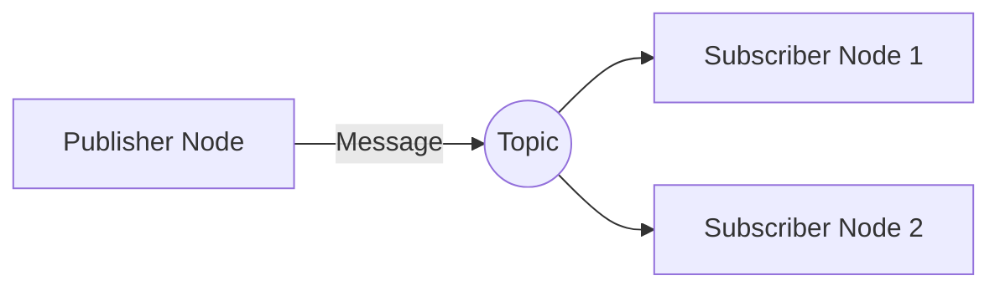

# Contributing to Physical AI & Humanoid Robotics

Thank you for your interest in contributing! This guide will help you get started with development, coding standards, and the contribution process.

## Table of Contents

- [Getting Started](#getting-started)
- [Development Setup](#development-setup)
- [Coding Standards](#coding-standards)
- [Contribution Workflow](#contribution-workflow)
- [Testing Requirements](#testing-requirements)
- [Documentation](#documentation)
- [Community Guidelines](#community-guidelines)

## Getting Started

### Prerequisites

Before contributing, ensure you have:
- Read the [README.md](README.md) and [SETUP.md](SETUP.md)
- Set up your local development environment
- Familiarized yourself with the project structure
- Checked existing [issues](https://github.com/YOUR_USERNAME/my_book/issues) and [pull requests](https://github.com/YOUR_USERNAME/my_book/pulls)

### What to Contribute

We welcome contributions in these areas:

**High Priority:**
- New book chapters (Unity, Isaac Sim, VLA systems, Conversational AI)
- Code examples and tutorials
- Bug fixes
- Documentation improvements
- Test coverage
- Performance optimizations

**Medium Priority:**
- UI/UX enhancements for chatbot
- Selection-based RAG mode
- Conversation history
- User authentication

**Low Priority:**
- Translations
- Additional deployment platforms
- Advanced features

## Development Setup

### 1. Fork and Clone

```bash
# Fork the repository on GitHub, then:
git clone https://github.com/YOUR_USERNAME/my_book.git
cd my_book
git remote add upstream https://github.com/ORIGINAL_OWNER/my_book.git
```

### 2. Create Feature Branch

```bash
git checkout -b feature/your-feature-name
# Or for bug fixes:
git checkout -b fix/bug-description
```

### 3. Install Dependencies

```bash
# Frontend
npm install

# Backend
python -m venv venv
venv\Scripts\activate  # Windows
# source venv/bin/activate  # macOS/Linux
pip install -r backend/requirements.txt

# Development tools
pip install black pylint pytest pytest-asyncio pytest-cov
npm install --save-dev eslint prettier
```

### 4. Configure Environment

```bash
cp .env.example .env
# Add your API keys (use your own test credentials)
```

## Coding Standards

### Frontend (TypeScript/React)

**Style Guide:**
- Use TypeScript for all new code
- Follow [Airbnb JavaScript Style Guide](https://github.com/airbnb/javascript)
- Use functional components with hooks (no class components)
- Use CSS Modules for component styling
- Prefix interface names with `I` (e.g., `IMessage`)

**Example:**
```typescript
interface IMessageProps {
  message: IMessage;
  onCitationClick?: (url: string) => void;
}

export default function MessageBubble({ message, onCitationClick }: IMessageProps): JSX.Element {
  const [isExpanded, setIsExpanded] = useState(false);

  return (
    <div className={styles.messageBubble}>
      {message.content}
    </div>
  );
}
```

**Formatting:**
```bash
# Run Prettier
npm run format

# Run ESLint
npm run lint
```

### Backend (Python/FastAPI)

**Style Guide:**
- Follow [PEP 8](https://peps.python.org/pep-0008/)
- Use type hints for all function signatures
- Use async/await for I/O operations
- Use Pydantic models for request/response validation
- Maximum line length: 100 characters

**Example:**
```python
from typing import List, Optional
from pydantic import BaseModel, Field

class QueryRequest(BaseModel):
    """Request model for RAG query"""
    query: str = Field(..., min_length=1, max_length=500)
    session_id: str = Field(default_factory=lambda: str(uuid.uuid4()))

    class Config:
        json_schema_extra = {
            "example": {
                "query": "What is ROS 2?",
                "session_id": "550e8400-e29b-41d4-a716-446655440000"
            }
        }

@router.post("/query", response_model=QueryResponse)
async def query_chatbot(
    request_data: QueryRequest,
    request: Request
) -> QueryResponse:
    """
    Process a RAG query and return answer with citations.

    Args:
        request_data: Query request containing query text and session ID
        request: FastAPI request object

    Returns:
        QueryResponse with answer, citations, and metadata

    Raises:
        HTTPException: If query is invalid or processing fails
    """
    # Implementation...
```

**Formatting:**
```bash
# Format with Black
black backend/src

# Lint with Pylint
pylint backend/src
```

### Documentation (MDX/Markdown)

**Style Guide:**
- Use sentence case for headings
- One sentence per line (for easier diffs)
- Include code examples for technical concepts
- Use Mermaid diagrams for architecture/flows
- Add frontmatter metadata to all docs

**Example:**
```mdx
---
sidebar_position: 2
---

# ROS 2 Publishers and Subscribers

## Overview

ROS 2 uses a publish-subscribe pattern for message passing.
This allows nodes to communicate without tight coupling.

## Architecture



## Code Example

\`\`\`python
import rclpy
from rclpy.node import Node
from std_msgs.msg import String

class PublisherNode(Node):
    def __init__(self):
        super().__init__('publisher')
        self.publisher = self.create_publisher(String, 'topic', 10)
\`\`\`
```

## Contribution Workflow

### 1. Check for Existing Issues

Before starting work:
- Search [existing issues](https://github.com/YOUR_USERNAME/my_book/issues)
- Comment on the issue to indicate you're working on it
- If no issue exists, create one first

### 2. Make Changes

```bash
# Ensure you're on your feature branch
git checkout feature/your-feature-name

# Make your changes
# ...

# Test locally
npm start                    # Frontend
cd backend/src && python main.py  # Backend
```

### 3. Write Tests

**Frontend tests:**
```typescript
// src/components/ChatbotWidget/__tests__/MessageBubble.test.tsx
import { render, screen } from '@testing-library/react';
import MessageBubble from '../MessageBubble';

test('renders user message correctly', () => {
  const message = {
    id: '1',
    role: 'user',
    content: 'Test message',
    timestamp: new Date()
  };

  render(<MessageBubble message={message} />);
  expect(screen.getByText('Test message')).toBeInTheDocument();
});
```

**Backend tests:**
```python
# backend/tests/test_query_routes.py
import pytest
from fastapi.testclient import TestClient
from backend.src.main import app

client = TestClient(app)

def test_query_endpoint_success():
    response = client.post(
        "/api/query",
        json={"query": "What is ROS 2?", "session_id": "test-123"}
    )
    assert response.status_code == 200
    data = response.json()
    assert "answer" in data
    assert "citations" in data
    assert len(data["citations"]) > 0
```

### 4. Commit Changes

**Commit Message Format:**
```
<type>(<scope>): <subject>

<body>

<footer>
```

**Types:**
- `feat`: New feature
- `fix`: Bug fix
- `docs`: Documentation changes
- `style`: Code style changes (formatting, no logic change)
- `refactor`: Code refactoring
- `test`: Adding or updating tests
- `chore`: Build process, dependencies, etc.

**Examples:**
```bash
git commit -m "feat(chatbot): add citation relevance scores to message bubbles"

git commit -m "fix(backend): handle empty query responses gracefully

- Add validation for empty Qdrant results
- Return helpful error message to user
- Add test case for empty results

Fixes #123"

git commit -m "docs(ros2): add advanced topics section with DDS configuration"
```

### 5. Push and Create Pull Request

```bash
# Push to your fork
git push origin feature/your-feature-name

# Go to GitHub and create a Pull Request
# Fill out the PR template (see below)
```

**Pull Request Template:**
```markdown
## Description
Brief description of changes.

## Type of Change
- [ ] Bug fix (non-breaking change fixing an issue)
- [ ] New feature (non-breaking change adding functionality)
- [ ] Breaking change (fix or feature causing existing functionality to change)
- [ ] Documentation update

## Related Issue
Fixes #(issue number)

## Changes Made
- Change 1
- Change 2
- Change 3

## Testing
- [ ] All existing tests pass
- [ ] Added new tests for changes
- [ ] Manually tested locally
- [ ] Updated documentation

## Checklist
- [ ] Code follows project style guidelines
- [ ] Self-reviewed code
- [ ] Commented complex logic
- [ ] Updated documentation
- [ ] No new warnings
- [ ] Added tests with >80% coverage
- [ ] All tests passing
```

### 6. Code Review Process

**What to expect:**
1. Automated checks run (linting, tests, build)
2. Maintainer reviews within 2-3 days
3. Feedback/requested changes
4. You address feedback
5. Approval and merge

**How to address feedback:**
```bash
# Make requested changes
# ...

# Commit and push
git add .
git commit -m "refactor: address PR feedback - improve error handling"
git push origin feature/your-feature-name
```

## Testing Requirements

### Minimum Coverage
- Backend: 80% code coverage
- Frontend: 70% code coverage
- New features: 90% coverage

### Run Tests

**Frontend:**
```bash
npm run test              # Run tests
npm run test:coverage     # With coverage report
```

**Backend:**
```bash
cd backend
pytest                    # Run all tests
pytest --cov=src          # With coverage
pytest --cov=src --cov-report=html  # HTML report
```

### Manual Testing Checklist

Before submitting PR, verify:
- [ ] Frontend builds without errors: `npm run build`
- [ ] Backend starts without errors: `python backend/src/main.py`
- [ ] Chatbot responds to test queries
- [ ] New book chapters render correctly
- [ ] Mermaid diagrams display properly
- [ ] Code examples have syntax highlighting
- [ ] Links work (no 404s)
- [ ] Dark mode works
- [ ] Mobile responsive (if UI changes)

## Documentation

### Update Documentation When:
- Adding new features
- Changing APIs
- Modifying configuration
- Adding new dependencies
- Changing deployment process

### Documentation Locations
- **User-facing docs**: `docs/` directory (MDX files)
- **API docs**: Docstrings in Python code (auto-generates Swagger UI)
- **Setup/deployment**: `SETUP.md`, `DEPLOYMENT.md`
- **Component docs**: `README.md` in component directories

### Example API Documentation
```python
async def query_chatbot(request_data: QueryRequest) -> QueryResponse:
    """
    Process a RAG query and return answer with citations.

    This endpoint:
    1. Validates the query
    2. Generates embeddings for the query
    3. Searches Qdrant for similar chunks
    4. Generates an answer using Gemini
    5. Extracts citations from search results
    6. Logs the query to Neon Postgres

    Args:
        request_data: QueryRequest containing:
            - query: User's question (1-500 chars)
            - session_id: UUID for session tracking

    Returns:
        QueryResponse containing:
            - answer: Generated answer text
            - citations: List of book section references
            - mode: Query mode ("full-book" or "selection")
            - latency_ms: Processing time in milliseconds
            - session_id: Echo of request session ID

    Raises:
        HTTPException:
            - 400: Invalid query (empty, too long)
            - 429: Rate limit exceeded (>10 queries/min)
            - 500: Internal server error

    Example:
        >>> request = QueryRequest(query="What is ROS 2?")
        >>> response = await query_chatbot(request)
        >>> print(response.answer)
        "ROS 2 is an open-source robotics middleware..."
    """
```

## Community Guidelines

### Code of Conduct

We are committed to providing a welcoming and inclusive environment. Please:
- Be respectful and professional
- Welcome newcomers
- Give constructive feedback
- Focus on the code, not the person
- Assume good intentions

### Getting Help

- **Questions**: [GitHub Discussions](https://github.com/YOUR_USERNAME/my_book/discussions)
- **Bugs**: [GitHub Issues](https://github.com/YOUR_USERNAME/my_book/issues)
- **Security**: Email security@example.com (do not file public issues)

### Recognition

Contributors are recognized in:
- `AUTHORS.md` file (all contributors)
- Release notes (for significant contributions)
- Annual contributor spotlight

## Additional Resources

- [SETUP.md](SETUP.md): Development environment setup
- [DEPLOYMENT.md](DEPLOYMENT.md): Deployment guide
- [FastAPI Docs](https://fastapi.tiangolo.com/): Backend framework
- [Docusaurus Docs](https://docusaurus.io/): Frontend framework
- [ROS 2 Docs](https://docs.ros.org/): Robotics content reference

---

Thank you for contributing to Physical AI & Humanoid Robotics! Your efforts help make robotics education more accessible to everyone.
