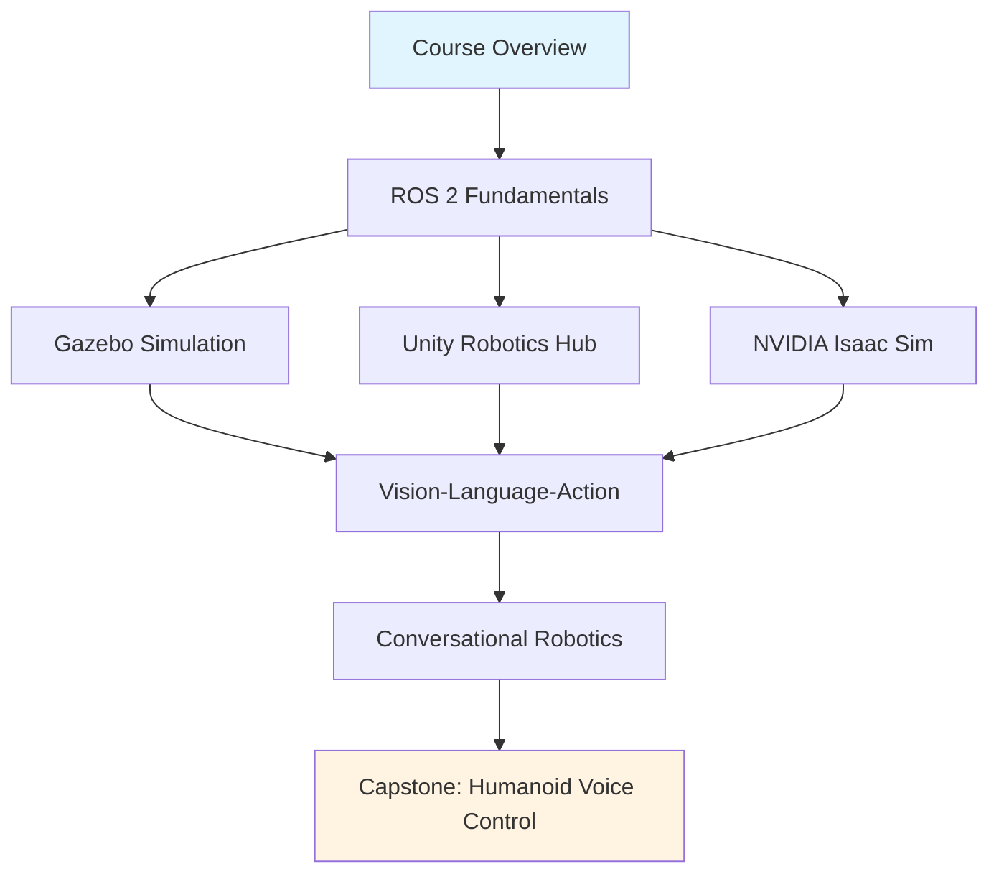

# Course Overview: Physical AI & Humanoid Robotics

Welcome to **Physical AI & Humanoid Robotics**, a comprehensive guide to AI-native software engineering for humanoid robots. This course bridges artificial intelligence, robotics, and real-world deployment to help you build intelligent physical systems.

## Learning Objectives

By the end of this course, you will be able to:

1. **Design and implement ROS 2 systems** for robotic perception, planning, and control
2. **Simulate robotic environments** using Gazebo 11 and NVIDIA Isaac Sim
3. **Integrate Vision-Language-Action (VLA) models** to ground natural language commands in physical actions
4. **Deploy AI models on edge hardware** (NVIDIA Jetson) for real-time robotic control
5. **Build a complete voice-controlled humanoid robot** as your capstone project

## Prerequisites

This is an intermediate to advanced course. You should have:

- **Programming**: Python 3.8+ (strong), C++ (basic familiarity)
- **Linux**: Ubuntu 22.04 command-line proficiency
- **Math**: Linear algebra (vectors, matrices), basic calculus
- **Robotics**: Basic concepts (kinematics, sensors, actuators)
- **AI/ML**: Familiarity with neural networks and LLMs (helpful but not required)

## Course Structure

The course follows a progressive learning path, building from fundamentals to advanced integration:



### Module Breakdown

1. **Course Overview** (this page) - Prerequisites, structure, hardware requirements
2. **ROS 2 Fundamentals** - Nodes, topics, services, actions, launch files
3. **Gazebo Simulation** - World files, robot models (URDF/SDF), sensor plugins
4. **Unity Robotics Hub** - Unity Simulation, ML-Agents, robot teleoperation
5. **NVIDIA Isaac Sim** - Synthetic data generation, domain randomization, Isaac ROS
6. **Vision-Language-Action (VLA)** - Grounding language to robot actions, RT-1/RT-2 models
7. **Conversational Robotics** - Speech-to-text (Whisper), LLM planning, text-to-speech
8. **Capstone Project** - Voice-controlled humanoid with navigation, manipulation, and perception

## Hardware Requirements

### Development Workstation (Required)

- **OS**: Ubuntu 22.04 LTS (native installation recommended)
- **CPU**: Intel i5/i7 or AMD Ryzen 5/7 (8+ cores)
- **RAM**: 16 GB minimum, 32 GB recommended
- **Storage**: 100 GB free SSD space
- **GPU**: NVIDIA RTX 2060 or higher (required for Isaac Sim)

### Edge Deployment Kit (Optional - for Capstone)

- **Compute**: NVIDIA Jetson Orin Nano (8GB) or Orin NX (16GB)
- **Camera**: Intel RealSense D435i depth camera
- **Microphone**: USB microphone or ReSpeaker array
- **Robot Platform**: TurtleBot3 Burger/Waffle or custom humanoid chassis

### Cloud Alternatives

If you don't have local GPU access:
- **AWS EC2**: g5.xlarge instance ($1.00/hour, A10G GPU) for Isaac Sim
- **Google Colab**: Free tier for ROS 2 and Gazebo examples (no GPU)

## Expected Outcomes

Upon completing this course and the capstone project, you will have:

✅ A **deployed voice-controlled robot** running on NVIDIA Jetson hardware
✅ A **GitHub portfolio** with 10+ runnable ROS 2 examples
✅ **Hands-on experience** with Gazebo, Unity, and Isaac Sim
✅ **Production-ready skills** for robotics AI engineering roles
✅ Understanding of the **full robotics stack** from simulation to hardware

## Time Commitment

- **Self-paced**: 10-12 weeks (10 hours/week)
- **Accelerated**: 6-8 weeks (20 hours/week with team)
- **Capstone project**: 3-4 weeks dedicated implementation

## Getting Started

Ready to begin? Start with [ROS 2 Fundamentals](/docs/modules/ros2/fundamentals) to build your robotics foundation.

### Quick Setup (Ubuntu 22.04)

```bash
# Install ROS 2 Humble
sudo apt update && sudo apt install -y ros-humble-desktop

# Install Gazebo 11
sudo apt install -y gazebo

# Clone course examples
git clone https://github.com/your-username/my_book.git
cd my_book/examples
```

Have questions while learning? Use the **AI chatbot** in the bottom-right corner to ask about any chapter content!

---

*Next Chapter: [ROS 2 Fundamentals →](/docs/modules/ros2/fundamentals)*
