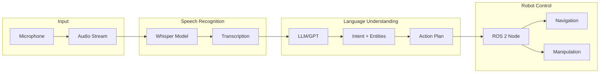
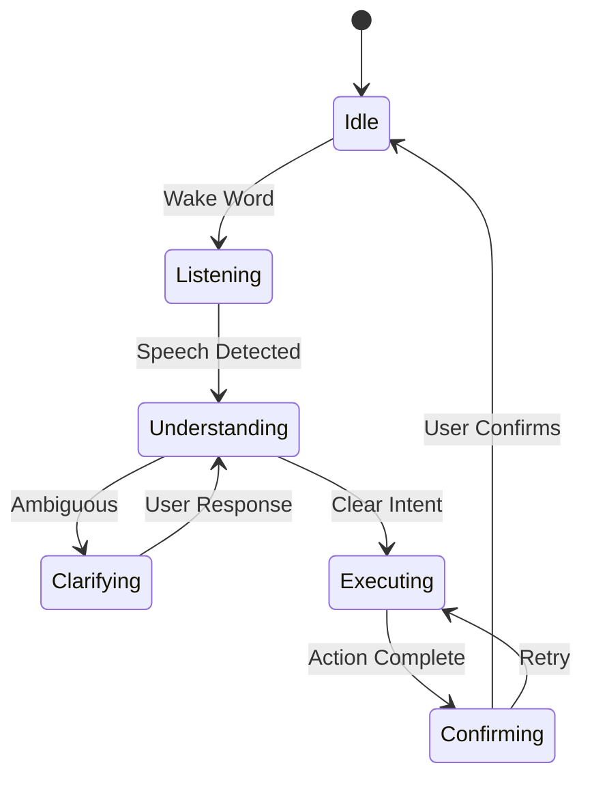

# Conversational Robotics

Conversational robotics combines speech recognition, natural language understanding, and robot control to create robots that respond to voice commands. This chapter covers the integration of Whisper, LLMs, and ROS 2 for building voice-controlled robotic systems.

## Architecture Overview

A complete conversational robotics pipeline consists of:



## Speech Recognition with Whisper

### Whisper Overview

OpenAI's Whisper is a robust speech recognition model trained on 680,000 hours of multilingual audio:

| Model | Parameters | English-Only | Multilingual | VRAM |
|-------|------------|--------------|--------------|------|
| tiny | 39M | ✓ | ✓ | 1 GB |
| base | 74M | ✓ | ✓ | 1 GB |
| small | 244M | ✓ | ✓ | 2 GB |
| medium | 769M | ✓ | ✓ | 5 GB |
| large-v3 | 1.55B | - | ✓ | 10 GB |

### Installation

```bash
# Install Whisper
pip install openai-whisper

# Or use faster-whisper for optimized inference
pip install faster-whisper

# Audio dependencies
sudo apt install portaudio19-dev ffmpeg
pip install pyaudio soundfile
```

### Basic Transcription

```python
import whisper
import sounddevice as sd
import numpy as np

class WhisperTranscriber:
    def __init__(self, model_size="base"):
        self.model = whisper.load_model(model_size)
        self.sample_rate = 16000

    def record_audio(self, duration=5):
        """Record audio from microphone."""
        print(f"Recording for {duration} seconds...")
        audio = sd.rec(
            int(duration * self.sample_rate),
            samplerate=self.sample_rate,
            channels=1,
            dtype=np.float32
        )
        sd.wait()
        return audio.flatten()

    def transcribe(self, audio):
        """Transcribe audio to text."""
        result = self.model.transcribe(
            audio,
            language="en",
            task="transcribe"
        )
        return result["text"]

    def listen_and_transcribe(self, duration=5):
        """Record and transcribe in one step."""
        audio = self.record_audio(duration)
        text = self.transcribe(audio)
        return text.strip()

# Usage
transcriber = WhisperTranscriber("small")
text = transcriber.listen_and_transcribe()
print(f"You said: {text}")
```

### Real-time Streaming

```python
import queue
import threading
from faster_whisper import WhisperModel

class StreamingTranscriber:
    def __init__(self, model_size="base"):
        self.model = WhisperModel(model_size, device="cuda", compute_type="float16")
        self.audio_queue = queue.Queue()
        self.sample_rate = 16000
        self.chunk_duration = 2.0  # seconds

    def audio_callback(self, indata, frames, time, status):
        """Callback for audio stream."""
        if status:
            print(f"Audio status: {status}")
        self.audio_queue.put(indata.copy())

    def start_stream(self):
        """Start continuous audio streaming."""
        self.stream = sd.InputStream(
            samplerate=self.sample_rate,
            channels=1,
            dtype=np.float32,
            callback=self.audio_callback,
            blocksize=int(self.sample_rate * self.chunk_duration)
        )
        self.stream.start()

    def transcribe_stream(self):
        """Continuously transcribe audio chunks."""
        while True:
            if not self.audio_queue.empty():
                audio = self.audio_queue.get().flatten()
                segments, _ = self.model.transcribe(audio, beam_size=5)

                for segment in segments:
                    yield segment.text

    def stop_stream(self):
        """Stop audio streaming."""
        self.stream.stop()
        self.stream.close()
```

## LLM-based Intent Understanding

### Action Planning with GPT

```python
import openai
from typing import List, Dict
import json

class RobotActionPlanner:
    def __init__(self, api_key: str):
        openai.api_key = api_key
        self.system_prompt = """You are a robot action planner. Given a voice command,
        extract the intent and generate a structured action plan.

        Available actions:
        - navigate_to(location: str) - Move robot to a location
        - pick_up(object: str) - Grasp an object
        - place_at(location: str) - Place held object at location
        - look_at(target: str) - Turn camera toward target
        - say(message: str) - Speak a message
        - wait(seconds: float) - Pause execution

        Respond with JSON containing:
        {
            "intent": "high-level intent description",
            "actions": [
                {"action": "action_name", "params": {...}},
                ...
            ],
            "confirmation": "what to say to confirm the command"
        }
        """

    def plan_actions(self, command: str) -> Dict:
        """Generate action plan from voice command."""
        response = openai.ChatCompletion.create(
            model="gpt-4",
            messages=[
                {"role": "system", "content": self.system_prompt},
                {"role": "user", "content": f"Command: {command}"}
            ],
            temperature=0.1,
            response_format={"type": "json_object"}
        )

        plan = json.loads(response.choices[0].message.content)
        return plan

# Example usage
planner = RobotActionPlanner(api_key="your-key")

command = "Go to the kitchen and bring me a water bottle"
plan = planner.plan_actions(command)
print(json.dumps(plan, indent=2))
# Output:
# {
#   "intent": "fetch water bottle from kitchen",
#   "actions": [
#     {"action": "navigate_to", "params": {"location": "kitchen"}},
#     {"action": "look_at", "params": {"target": "water bottle"}},
#     {"action": "pick_up", "params": {"object": "water bottle"}},
#     {"action": "navigate_to", "params": {"location": "user"}},
#     {"action": "say", "params": {"message": "Here is your water bottle"}}
#   ],
#   "confirmation": "I'll go to the kitchen and bring you a water bottle"
# }
```

### Function Calling for Structured Output

```python
from openai import OpenAI

client = OpenAI()

tools = [
    {
        "type": "function",
        "function": {
            "name": "navigate_to",
            "description": "Navigate the robot to a specified location",
            "parameters": {
                "type": "object",
                "properties": {
                    "location": {
                        "type": "string",
                        "description": "Target location (e.g., kitchen, living room, bedroom)"
                    },
                    "speed": {
                        "type": "string",
                        "enum": ["slow", "normal", "fast"],
                        "description": "Navigation speed"
                    }
                },
                "required": ["location"]
            }
        }
    },
    {
        "type": "function",
        "function": {
            "name": "pick_up_object",
            "description": "Pick up an object with the robot gripper",
            "parameters": {
                "type": "object",
                "properties": {
                    "object_name": {
                        "type": "string",
                        "description": "Name of the object to pick up"
                    },
                    "grasp_type": {
                        "type": "string",
                        "enum": ["precision", "power"],
                        "description": "Type of grasp to use"
                    }
                },
                "required": ["object_name"]
            }
        }
    }
]

def process_command(command: str):
    """Process voice command using function calling."""
    response = client.chat.completions.create(
        model="gpt-4-turbo",
        messages=[
            {"role": "system", "content": "You control a mobile manipulation robot."},
            {"role": "user", "content": command}
        ],
        tools=tools,
        tool_choice="auto"
    )

    # Extract function calls
    message = response.choices[0].message
    if message.tool_calls:
        for tool_call in message.tool_calls:
            function_name = tool_call.function.name
            arguments = json.loads(tool_call.function.arguments)
            print(f"Execute: {function_name}({arguments})")
            yield function_name, arguments
```

## ROS 2 Integration

### Voice Command Node

```python
#!/usr/bin/env python3
# voice_command_node.py

import rclpy
from rclpy.node import Node
from std_msgs.msg import String
from geometry_msgs.msg import PoseStamped
from nav2_msgs.action import NavigateToPose
from rclpy.action import ActionClient
import whisper
import sounddevice as sd
import numpy as np
import json

class VoiceCommandNode(Node):
    def __init__(self):
        super().__init__('voice_command_node')

        # Whisper model
        self.whisper = whisper.load_model("small")
        self.sample_rate = 16000

        # Publishers
        self.command_pub = self.create_publisher(String, '/voice/command', 10)
        self.status_pub = self.create_publisher(String, '/voice/status', 10)

        # Navigation action client
        self.nav_client = ActionClient(self, NavigateToPose, 'navigate_to_pose')

        # Location mapping
        self.locations = {
            "kitchen": {"x": 5.0, "y": 2.0, "theta": 0.0},
            "living room": {"x": 0.0, "y": 0.0, "theta": 0.0},
            "bedroom": {"x": -3.0, "y": 4.0, "theta": 1.57},
            "bathroom": {"x": -3.0, "y": -2.0, "theta": 3.14}
        }

        # Start listening timer
        self.listen_timer = self.create_timer(0.1, self.check_for_wake_word)
        self.is_listening = False

        self.get_logger().info("Voice command node initialized")

    def record_audio(self, duration=5):
        """Record audio from microphone."""
        self.get_logger().info(f"Listening for {duration} seconds...")
        audio = sd.rec(
            int(duration * self.sample_rate),
            samplerate=self.sample_rate,
            channels=1,
            dtype=np.float32
        )
        sd.wait()
        return audio.flatten()

    def transcribe(self, audio):
        """Transcribe audio using Whisper."""
        result = self.whisper.transcribe(audio, language="en")
        return result["text"].strip().lower()

    def check_for_wake_word(self):
        """Check for wake word activation."""
        if not self.is_listening:
            # Short recording for wake word detection
            audio = self.record_audio(duration=2)
            text = self.transcribe(audio)

            if "hey robot" in text or "okay robot" in text:
                self.is_listening = True
                self.status_pub.publish(String(data="listening"))
                self.get_logger().info("Wake word detected! Listening for command...")
                self.process_command()

    def process_command(self):
        """Process the voice command after wake word."""
        # Record longer audio for command
        audio = self.record_audio(duration=5)
        command = self.transcribe(audio)

        self.get_logger().info(f"Command received: {command}")
        self.command_pub.publish(String(data=command))

        # Parse and execute command
        self.execute_command(command)
        self.is_listening = False

    def execute_command(self, command: str):
        """Execute the parsed command."""
        # Simple keyword-based parsing
        if "go to" in command or "navigate to" in command:
            for location, pose in self.locations.items():
                if location in command:
                    self.navigate_to(pose)
                    return

        if "stop" in command:
            self.cancel_navigation()
            return

        if "come here" in command or "come back" in command:
            self.navigate_to(self.locations["living room"])
            return

        self.get_logger().warn(f"Unknown command: {command}")

    def navigate_to(self, pose_dict):
        """Send navigation goal."""
        goal = NavigateToPose.Goal()
        goal.pose = PoseStamped()
        goal.pose.header.frame_id = "map"
        goal.pose.header.stamp = self.get_clock().now().to_msg()
        goal.pose.pose.position.x = pose_dict["x"]
        goal.pose.pose.position.y = pose_dict["y"]

        # Convert theta to quaternion (simplified)
        import math
        goal.pose.pose.orientation.z = math.sin(pose_dict["theta"] / 2)
        goal.pose.pose.orientation.w = math.cos(pose_dict["theta"] / 2)

        self.get_logger().info(f"Navigating to: {pose_dict}")
        self.nav_client.send_goal_async(goal)

    def cancel_navigation(self):
        """Cancel current navigation."""
        self.nav_client.cancel_goal_async()
        self.get_logger().info("Navigation cancelled")

def main():
    rclpy.init()
    node = VoiceCommandNode()
    rclpy.spin(node)
    rclpy.shutdown()

if __name__ == '__main__':
    main()
```

### Text-to-Speech Response

```python
#!/usr/bin/env python3
# tts_node.py

import rclpy
from rclpy.node import Node
from std_msgs.msg import String
import pyttsx3
from gtts import gTTS
import pygame
import io

class TTSNode(Node):
    def __init__(self):
        super().__init__('tts_node')

        # TTS engine (offline)
        self.engine = pyttsx3.init()
        self.engine.setProperty('rate', 150)
        self.engine.setProperty('volume', 0.9)

        # Subscriber
        self.speech_sub = self.create_subscription(
            String, '/robot/speak', self.speak_callback, 10
        )

        # Initialize pygame for gTTS playback
        pygame.mixer.init()

        self.get_logger().info("TTS node initialized")

    def speak_callback(self, msg):
        """Handle incoming speech requests."""
        text = msg.data
        self.get_logger().info(f"Speaking: {text}")
        self.speak_online(text)  # or self.speak_offline(text)

    def speak_offline(self, text: str):
        """Speak using pyttsx3 (offline)."""
        self.engine.say(text)
        self.engine.runAndWait()

    def speak_online(self, text: str):
        """Speak using Google TTS (requires internet)."""
        tts = gTTS(text=text, lang='en')
        fp = io.BytesIO()
        tts.write_to_fp(fp)
        fp.seek(0)

        pygame.mixer.music.load(fp)
        pygame.mixer.music.play()

        while pygame.mixer.music.get_busy():
            pygame.time.Clock().tick(10)

def main():
    rclpy.init()
    node = TTSNode()
    rclpy.spin(node)
    rclpy.shutdown()

if __name__ == '__main__':
    main()
```

## Dialogue Management

### Context-Aware Conversations



### Dialogue State Machine

```python
from enum import Enum, auto
from dataclasses import dataclass
from typing import Optional, List

class DialogueState(Enum):
    IDLE = auto()
    LISTENING = auto()
    UNDERSTANDING = auto()
    CLARIFYING = auto()
    EXECUTING = auto()
    CONFIRMING = auto()

@dataclass
class DialogueContext:
    state: DialogueState = DialogueState.IDLE
    current_intent: Optional[str] = None
    entities: dict = None
    action_history: List[str] = None
    clarification_attempts: int = 0

    def __post_init__(self):
        self.entities = self.entities or {}
        self.action_history = self.action_history or []

class DialogueManager:
    def __init__(self, planner, tts_publisher):
        self.context = DialogueContext()
        self.planner = planner
        self.tts_publisher = tts_publisher

    def handle_input(self, text: str):
        """Process user input based on current state."""
        if self.context.state == DialogueState.IDLE:
            return self.start_dialogue(text)
        elif self.context.state == DialogueState.CLARIFYING:
            return self.handle_clarification(text)
        elif self.context.state == DialogueState.CONFIRMING:
            return self.handle_confirmation(text)

    def start_dialogue(self, command: str):
        """Start processing a new command."""
        self.context.state = DialogueState.UNDERSTANDING

        plan = self.planner.plan_actions(command)

        if plan.get("needs_clarification"):
            self.context.state = DialogueState.CLARIFYING
            self.speak(plan["clarification_question"])
            return

        self.context.current_intent = plan["intent"]
        self.context.state = DialogueState.EXECUTING
        self.speak(plan["confirmation"])
        return plan["actions"]

    def handle_clarification(self, response: str):
        """Handle user clarification response."""
        self.context.clarification_attempts += 1

        if self.context.clarification_attempts > 3:
            self.speak("I'm having trouble understanding. Let's start over.")
            self.reset()
            return

        # Re-process with clarification
        combined = f"{self.context.current_intent}, specifically {response}"
        return self.start_dialogue(combined)

    def handle_confirmation(self, response: str):
        """Handle user confirmation."""
        if any(word in response.lower() for word in ["yes", "correct", "right", "okay"]):
            self.speak("Great, task completed!")
            self.reset()
        else:
            self.speak("I'll try again.")
            self.context.state = DialogueState.EXECUTING

    def speak(self, text: str):
        """Publish TTS message."""
        from std_msgs.msg import String
        msg = String(data=text)
        self.tts_publisher.publish(msg)

    def reset(self):
        """Reset dialogue context."""
        self.context = DialogueContext()
```

## Edge Deployment on Jetson

### Optimized Whisper on Jetson

```python
# Using faster-whisper with CTranslate2 for Jetson
from faster_whisper import WhisperModel
import numpy as np

class JetsonWhisper:
    def __init__(self, model_size="small"):
        # Use int8 quantization for Jetson
        self.model = WhisperModel(
            model_size,
            device="cuda",
            compute_type="int8_float16"  # Optimized for Jetson
        )

    def transcribe(self, audio: np.ndarray) -> str:
        segments, info = self.model.transcribe(
            audio,
            beam_size=5,
            best_of=5,
            vad_filter=True,  # Voice activity detection
            vad_parameters=dict(
                min_silence_duration_ms=500,
                speech_pad_ms=400
            )
        )

        text = " ".join([segment.text for segment in segments])
        return text.strip()
```

### Performance Comparison

| Platform | Model | Inference Time | Memory |
|----------|-------|----------------|--------|
| Jetson Orin Nano | small (int8) | 1.2s | 1.5 GB |
| Jetson Orin NX | small (fp16) | 0.8s | 2 GB |
| Jetson AGX Orin | medium (fp16) | 0.5s | 5 GB |
| RTX 3080 | large-v3 | 0.3s | 10 GB |

## Summary

### Key Takeaways

1. **Whisper Integration**: Robust speech recognition with multiple model sizes
2. **LLM Planning**: Use GPT-4 function calling for structured action plans
3. **ROS 2 Nodes**: Modular architecture for voice command processing
4. **Dialogue Management**: State machine for context-aware conversations
5. **Edge Optimization**: Quantized models for Jetson deployment

### Next Steps

- Build the complete [Capstone Project](/docs/modules/capstone/humanoid-voice-control)
- Explore [Vision-Language-Action](/docs/modules/vla/intro) for multimodal control
- Learn about [NVIDIA Isaac Sim](/docs/modules/isaac/intro) for training

## Resources

- [OpenAI Whisper](https://github.com/openai/whisper)
- [Faster Whisper](https://github.com/guillaumekln/faster-whisper)
- [ROS 2 Audio Common](https://github.com/ros-drivers/audio_common)
- [LangChain Agents](https://python.langchain.com/docs/modules/agents/)
