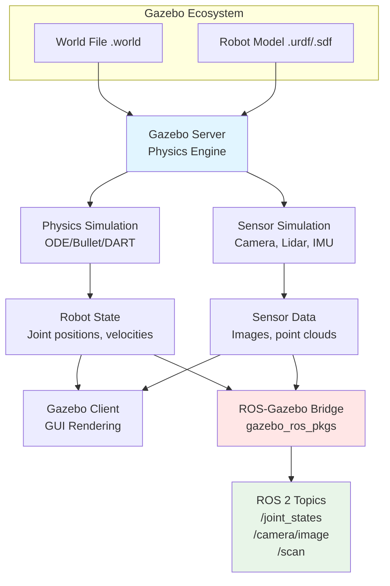

# Gazebo Simulation

**Gazebo** is the most widely-used 3D robotics simulator, enabling you to test algorithms in realistic environments before deploying to hardware. It's essential for rapid prototyping, regression testing, and scenarios too dangerous or expensive for real robots.

## Why Gazebo?

### Benefits of Simulation

✅ **Safe testing** - Test collision avoidance without damaging hardware
✅ **Rapid iteration** - Change robot designs in minutes, not days
✅ **Reproducible experiments** - Exact same conditions every run
✅ **Cost-effective** - No need for multiple physical robots
✅ **Parallel testing** - Run 10+ simulations simultaneously

### Gazebo vs Alternatives

| Feature | Gazebo | Isaac Sim | Unity | Webots |
|---------|--------|-----------|-------|--------|
| **Physics Engine** | ODE, Bullet, DART | PhysX 5 | PhysX | ODE |
| **ROS 2 Integration** | ✅ Native | Via Isaac ROS | Via ROS TCP | ✅ Native |
| **Sensor Realism** | Good | Excellent (RTX) | Good | Good |
| **Learning Curve** | Medium | Steep | Medium | Easy |
| **GPU Required** | No | Yes (RTX) | Recommended | No |
| **Best For** | General robotics | AI training | Game-like envs | Education |

**Use Gazebo when**: You need fast, lightweight simulation with excellent ROS 2 support.

## Gazebo Architecture

Gazebo consists of two main components working together:



### Components Explained

1. **Gazebo Server** (gzserver)
   - Runs physics simulation
   - Generates sensor data
   - Headless (no GUI) for CI/CD

2. **Gazebo Client** (gzclient)
   - 3D visualization
   - Interactive scene editing
   - Can run on separate machine

3. **ROS-Gazebo Bridge** (gazebo_ros)
   - Publishes sensor data to ROS 2 topics
   - Subscribes to control commands
   - Provides services for spawning/deleting models

## World Files (.world)

A **world file** defines the simulation environment:

```xml
<?xml version="1.0"?>
<sdf version="1.6">
  <world name="warehouse">
    <!-- Physics engine configuration -->
    <physics type="ode">
      <max_step_size>0.001</max_step_size>
      <real_time_factor>1.0</real_time_factor>
      <real_time_update_rate>1000</real_time_update_rate>
    </physics>

    <!-- Lighting -->
    <include>
      <uri>model://sun</uri>
    </include>

    <!-- Ground plane -->
    <include>
      <uri>model://ground_plane</uri>
    </include>

    <!-- Custom warehouse model -->
    <model name="warehouse_walls">
      <static>true</static>
      <link name="walls">
        <!-- Geometry and collision definitions -->
      </link>
    </model>

    <!-- Obstacles -->
    <include>
      <uri>model://cardboard_box</uri>
      <pose>2 3 0 0 0 0</pose>
    </include>

  </world>
</sdf>
```

**Key elements**:
- **Physics**: Solver type, timestep, real-time factor
- **Models**: Static (buildings) and dynamic (objects)
- **Lighting**: Ambient, directional, point lights
- **Plugins**: Custom behaviors (wind, moving obstacles)

## Robot Models (URDF/SDF)

### URDF (Unified Robot Description Format)

URDF is the ROS standard for robot models:

```xml
<?xml version="1.0"?>
<robot name="simple_robot">
  <!-- Base link -->
  <link name="base_link">
    <visual>
      <geometry>
        <box size="0.5 0.3 0.2"/>
      </geometry>
      <material name="blue">
        <color rgba="0 0 0.8 1"/>
      </material>
    </visual>
    <collision>
      <geometry>
        <box size="0.5 0.3 0.2"/>
      </geometry>
    </collision>
    <inertial>
      <mass value="10"/>
      <inertia ixx="0.1" ixy="0" ixz="0" iyy="0.1" iyz="0" izz="0.1"/>
    </inertial>
  </link>

  <!-- Wheel link -->
  <link name="left_wheel">
    <visual>
      <geometry>
        <cylinder radius="0.1" length="0.05"/>
      </geometry>
    </visual>
    <!-- Collision and inertial omitted for brevity -->
  </link>

  <!-- Joint connecting base to wheel -->
  <joint name="left_wheel_joint" type="continuous">
    <parent link="base_link"/>
    <child link="left_wheel"/>
    <origin xyz="0 0.15 -0.1" rpy="0 0 0"/>
    <axis xyz="0 1 0"/>
  </joint>

  <!-- Gazebo plugin for sensors -->
  <gazebo reference="base_link">
    <sensor name="camera" type="camera">
      <update_rate>30</update_rate>
      <camera>
        <horizontal_fov>1.047</horizontal_fov>
        <image>
          <width>640</width>
          <height>480</height>
        </image>
      </camera>
      <plugin name="camera_controller" filename="libgazebo_ros_camera.so">
        <ros>
          <namespace>/robot</namespace>
          <remapping>~/image_raw:=/camera/image_raw</remapping>
        </ros>
      </plugin>
    </sensor>
  </gazebo>
</robot>
```

**URDF components**:
- **Links**: Rigid bodies with visual, collision, and inertial properties
- **Joints**: Connections between links (fixed, revolute, prismatic, continuous)
- **Sensors**: Camera, Lidar, IMU (via Gazebo plugins)
- **Actuators**: Motors and controllers

### SDF (Simulation Description Format)

SDF is Gazebo's native format with more features than URDF:

```xml
<sdf version="1.6">
  <model name="advanced_robot">
    <link name="chassis">
      <!-- More detailed physics properties -->
      <inertial>
        <pose>0 0 0.1 0 0 0</pose>
        <mass>15.0</mass>
        <inertia>
          <ixx>0.147</ixx>
          <ixy>0</ixy>
          <!-- ... -->
        </inertia>
      </inertial>

      <!-- Multiple collision shapes -->
      <collision name="collision_chassis">
        <geometry>
          <box><size>0.5 0.3 0.2</size></box>
        </geometry>
        <surface>
          <friction>
            <ode>
              <mu>0.5</mu>
              <mu2>0.5</mu2>
            </ode>
          </friction>
        </surface>
      </collision>
    </link>

    <!-- Differential drive plugin -->
    <plugin name="diff_drive" filename="libgazebo_ros_diff_drive.so">
      <ros>
        <namespace>/robot</namespace>
      </ros>
      <left_joint>left_wheel_joint</left_joint>
      <right_joint>right_wheel_joint</right_joint>
      <wheel_separation>0.3</wheel_separation>
      <wheel_diameter>0.2</wheel_diameter>
      <max_wheel_torque>20</max_wheel_torque>
      <publish_odom>true</publish_odom>
      <publish_odom_tf>true</publish_odom_tf>
      <odometry_frame>odom</odometry_frame>
      <robot_base_frame>base_link</robot_base_frame>
    </plugin>
  </model>
</sdf>
```

## Sensor Simulation

Gazebo supports realistic sensor simulation:

### 1. Camera (RGB)

```xml
<gazebo reference="camera_link">
  <sensor name="camera" type="camera">
    <update_rate>30</update_rate>
    <visualize>true</visualize>
    <camera>
      <horizontal_fov>1.047</horizontal_fov>
      <image>
        <width>640</width>
        <height>480</height>
        <format>R8G8B8</format>
      </image>
      <clip>
        <near>0.1</near>
        <far>100</far>
      </clip>
      <noise>
        <type>gaussian</type>
        <mean>0.0</mean>
        <stddev>0.007</stddev>
      </noise>
    </camera>
    <plugin name="camera_controller" filename="libgazebo_ros_camera.so">
      <ros>
        <remapping>~/image_raw:=/camera/image_raw</remapping>
      </ros>
    </plugin>
  </sensor>
</gazebo>
```

### 2. Lidar (2D/3D)

```xml
<sensor name="lidar" type="ray">
  <update_rate>10</update_rate>
  <ray>
    <scan>
      <horizontal>
        <samples>360</samples>
        <resolution>1</resolution>
        <min_angle>-3.14159</min_angle>
        <max_angle>3.14159</max_angle>
      </horizontal>
    </scan>
    <range>
      <min>0.1</min>
      <max>30.0</max>
      <resolution>0.01</resolution>
    </range>
  </ray>
  <plugin name="lidar_controller" filename="libgazebo_ros_ray_sensor.so">
    <ros>
      <remapping>~/out:=/scan</remapping>
    </ros>
    <output_type>sensor_msgs/LaserScan</output_type>
  </plugin>
</sensor>
```

### 3. IMU (Inertial Measurement Unit)

```xml
<sensor name="imu" type="imu">
  <update_rate>100</update_rate>
  <imu>
    <angular_velocity>
      <x><noise type="gaussian"><stddev>0.01</stddev></noise></x>
      <y><noise type="gaussian"><stddev>0.01</stddev></noise></y>
      <z><noise type="gaussian"><stddev>0.01</stddev></noise></z>
    </angular_velocity>
    <linear_acceleration>
      <x><noise type="gaussian"><stddev>0.1</stddev></noise></x>
      <y><noise type="gaussian"><stddev>0.1</stddev></noise></y>
      <z><noise type="gaussian"><stddev>0.1</stddev></noise></z>
    </linear_acceleration>
  </imu>
  <plugin name="imu_plugin" filename="libgazebo_ros_imu_sensor.so"/>
</sensor>
```

## Launching Gazebo with ROS 2

### Simple Launch

```python
from launch import LaunchDescription
from launch.actions import IncludeLaunchDescription
from launch.launch_description_sources import PythonLaunchDescriptionSource
from launch_ros.actions import Node

def generate_launch_description():
    return LaunchDescription([
        # Start Gazebo with empty world
        IncludeLaunchDescription(
            PythonLaunchDescriptionSource([
                '/opt/ros/humble/share/gazebo_ros/launch/gazebo.launch.py'
            ]),
            launch_arguments={'world': 'warehouse.world'}.items()
        ),

        # Spawn robot
        Node(
            package='gazebo_ros',
            executable='spawn_entity.py',
            arguments=['-entity', 'my_robot', '-file', 'robot.urdf'],
            output='screen'
        ),
    ])
```

### Running

```bash
# Launch simulation
ros2 launch my_package warehouse_sim.launch.py

# Control robot
ros2 topic pub /cmd_vel geometry_msgs/msg/Twist "{linear: {x: 0.5}}"

# View camera feed
ros2 run rqt_image_view rqt_image_view /camera/image_raw

# View lidar data
rviz2
```

## Hands-On Example: Warehouse Simulation

See `examples/gazebo/warehouse_sim.launch.py` for a complete example with:

- Warehouse environment with obstacles
- TurtleBot3 robot with differential drive
- 2D Lidar for obstacle detection
- RGB camera for object detection

```bash
cd examples/gazebo
ros2 launch warehouse_sim.launch.py
```

## Best Practices

1. **Start simple** - Test with empty world before adding complexity
2. **Use realistic physics** - Match robot mass, friction, inertia to real hardware
3. **Add sensor noise** - Gaussian noise prevents overfitting to perfect data
4. **Profile performance** - Monitor CPU usage, aim for real-time factor ≥ 1.0
5. **Version control models** - Use Git LFS for mesh files

## Common Issues

### Slow simulation (RTF < 1.0)
- Reduce physics step size
- Simplify collision meshes
- Disable unnecessary sensors
- Run headless (gzserver only)

### Robot falls through ground
- Check collision geometry exists
- Verify inertial properties
- Increase physics iterations

### Topics not publishing
- Check plugin namespace
- Verify remapping in launch file
- Ensure Gazebo ROS bridge is running

## Next Steps

1. **[NVIDIA Isaac Sim](/docs/modules/isaac/intro)** - GPU-accelerated simulation with RTX rendering
2. **[Capstone Project](/docs/modules/capstone/humanoid-voice-control)** - Test your humanoid in Gazebo first

## Resources

- **Official docs**: [gazebosim.org/docs](http://gazebosim.org/docs)
- **Model library**: [github.com/osrf/gazebo_models](https://github.com/osrf/gazebo_models)
- **ROS 2 + Gazebo tutorial**: [docs.ros.org/en/humble/Tutorials/Advanced/Simulators/Gazebo](https://docs.ros.org/en/humble/Tutorials/Advanced/Simulators/Gazebo.html)

---

*Previous: [← ROS 2 Fundamentals](/docs/modules/ros2/fundamentals) | Next: [NVIDIA Isaac Sim →](/docs/modules/isaac/intro)*
