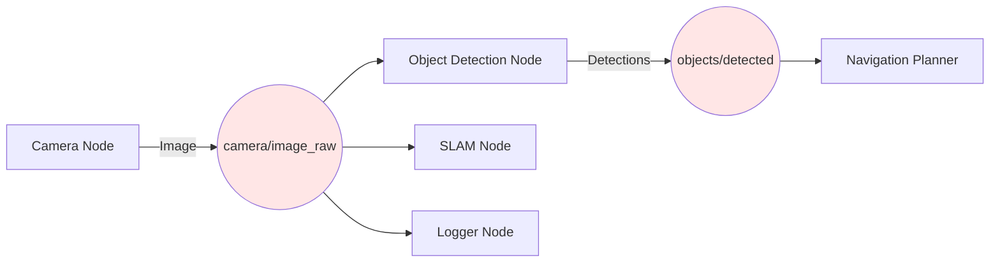
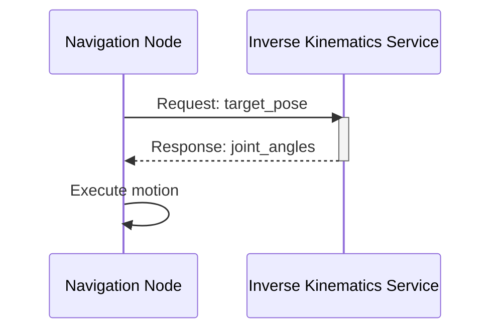
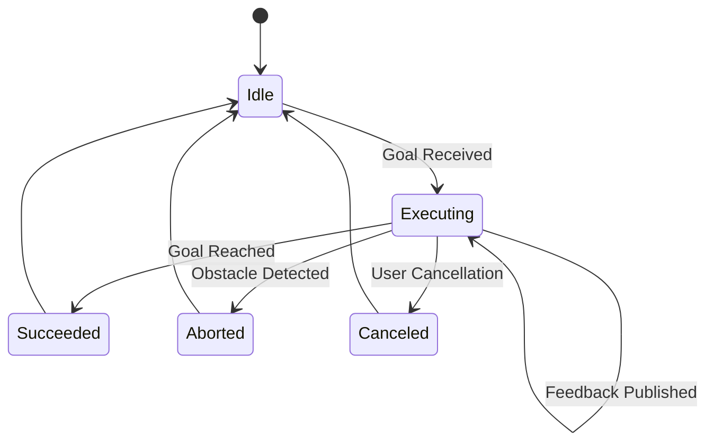
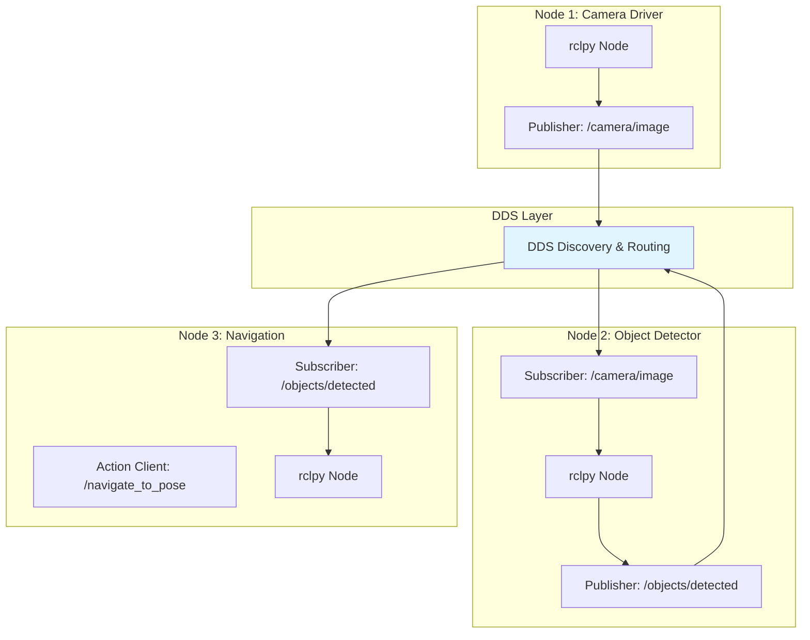

# ROS 2 Fundamentals

**Robot Operating System 2 (ROS 2)** is the industry-standard middleware for building modular, distributed robotic systems. Unlike ROS 1, ROS 2 is production-ready with real-time capabilities, security, and multi-robot support.

## What is ROS 2?

ROS 2 is not an operating system—it's a **middleware framework** that provides:

- **Communication infrastructure** between robot components (nodes)
- **Standard message formats** for sensors, actuators, and algorithms
- **Development tools** for debugging, visualization, and testing
- **Community packages** for SLAM, navigation, perception, and manipulation

### ROS 1 vs ROS 2

| Feature | ROS 1 (Melodic/Noetic) | ROS 2 (Humble/Iron) |
|---------|------------------------|---------------------|
| **Communication** | TCP/XMLRPC (custom) | DDS (industry standard) |
| **Real-time** | No | Yes (with DDS-RT) |
| **Security** | None | Built-in (SROS2) |
| **Multi-robot** | Complex workarounds | Native support |
| **Platforms** | Linux only | Linux, Windows, macOS |
| **Python** | 2.7 / 3.5+ | 3.8+ |
| **Support** | EOL 2025 | Active development |

**When to use ROS 2**: New projects, production deployments, multi-robot systems, safety-critical applications.

## Core Concepts

### 1. Nodes

A **node** is a single executable program that performs a specific task (e.g., read camera, plan path, control motor).

```python
import rclpy
from rclpy.node import Node

class MinimalNode(Node):
    def __init__(self):
        super().__init__('minimal_node')
        self.get_logger().info('Node started!')

def main():
    rclpy.init()
    node = MinimalNode()
    rclpy.spin(node)
    node.destroy_node()
    rclpy.shutdown()
```

**Key principles**:
- Each node runs independently (separate process)
- Nodes communicate via topics, services, or actions
- A robot system = graph of interconnected nodes

### 2. Topics (Publish/Subscribe)

**Topics** enable asynchronous, one-to-many communication. Publishers send messages; subscribers receive them.



**Example: Publisher**

```python
from sensor_msgs.msg import Image
import rclpy
from rclpy.node import Node

class CameraPublisher(Node):
    def __init__(self):
        super().__init__('camera_publisher')
        self.publisher = self.create_publisher(Image, 'camera/image_raw', 10)
        self.timer = self.create_timer(0.1, self.publish_image)  # 10 Hz

    def publish_image(self):
        msg = Image()
        # ... fill image data ...
        self.publisher.publish(msg)
        self.get_logger().info('Published image')
```

**Example: Subscriber**

```python
class ImageSubscriber(Node):
    def __init__(self):
        super().__init__('image_subscriber')
        self.subscription = self.create_subscription(
            Image,
            'camera/image_raw',
            self.image_callback,
            10
        )

    def image_callback(self, msg):
        self.get_logger().info(f'Received image: {msg.width}x{msg.height}')
```

### 3. Services (Request/Response)

**Services** enable synchronous, one-to-one communication. A client sends a request and waits for a response.



**Use cases**: Configuration changes, one-time computations (IK, path planning)

```python
from example_interfaces.srv import AddTwoInts

class AddService(Node):
    def __init__(self):
        super().__init__('add_service')
        self.srv = self.create_service(AddTwoInts, 'add_two_ints', self.add_callback)

    def add_callback(self, request, response):
        response.sum = request.a + request.b
        self.get_logger().info(f'{request.a} + {request.b} = {response.sum}')
        return response
```

### 4. Actions (Long-Running Tasks)

**Actions** combine topics and services for tasks with feedback and cancellation (e.g., navigation to goal).



**Components**:
- **Goal**: Target to achieve (e.g., x, y coordinates)
- **Feedback**: Progress updates (e.g., distance remaining)
- **Result**: Final status (succeeded, aborted, canceled)

### 5. Parameters

**Parameters** are configuration values that can be changed at runtime.

```python
class ConfigurableNode(Node):
    def __init__(self):
        super().__init__('configurable_node')
        self.declare_parameter('update_rate', 10.0)
        self.declare_parameter('topic_name', 'sensor_data')

        rate = self.get_parameter('update_rate').value
        topic = self.get_parameter('topic_name').value

        self.get_logger().info(f'Publishing to {topic} at {rate} Hz')
```

Set parameters via command line:
```bash
ros2 run my_package my_node --ros-args -p update_rate:=20.0
```

## ROS 2 Communication Architecture

Here's how nodes communicate using DDS (Data Distribution Service):



**Key advantages of DDS**:
- **Discovery**: Nodes find each other automatically (no roscore!)
- **QoS**: Quality of Service policies (reliability, history depth, latency)
- **Scalability**: Supports thousands of nodes across networks

## Quality of Service (QoS)

QoS profiles control message delivery guarantees:

```python
from rclpy.qos import QoSProfile, ReliabilityPolicy, HistoryPolicy

# Best effort (fast, lossy) - good for sensors
qos_profile = QoSProfile(
    reliability=ReliabilityPolicy.BEST_EFFORT,
    history=HistoryPolicy.KEEP_LAST,
    depth=10
)

self.subscription = self.create_subscription(
    LaserScan,
    '/scan',
    self.scan_callback,
    qos_profile
)
```

**Common QoS profiles**:
- **Sensor data**: Best effort, keep last 10
- **Control commands**: Reliable, keep last 1
- **Telemetry**: Best effort, keep all (streaming)

## Hands-On Example: Talker and Listener

See the runnable example in `examples/ros2/talker_listener/`:

```bash
# Terminal 1: Run talker
ros2 run examples talker

# Terminal 2: Run listener
ros2 run examples listener

# Terminal 3: Inspect topic
ros2 topic echo /chatter
ros2 topic hz /chatter
```

## Essential CLI Tools

```bash
# List running nodes
ros2 node list

# Get node info
ros2 node info /my_node

# List topics
ros2 topic list

# Echo topic data
ros2 topic echo /camera/image_raw

# Publish to topic
ros2 topic pub /cmd_vel geometry_msgs/msg/Twist "{linear: {x: 0.5}}"

# List services
ros2 service list

# Call service
ros2 service call /add_two_ints example_interfaces/srv/AddTwoInts "{a: 5, b: 3}"

# List parameters
ros2 param list

# Get parameter value
ros2 param get /my_node update_rate
```

## Next Steps

Now that you understand ROS 2 fundamentals, proceed to:

1. **[Gazebo Simulation](/docs/modules/gazebo/intro)** - Test your nodes in simulation
2. **[NVIDIA Isaac Sim](/docs/modules/isaac/intro)** - Advanced simulation with synthetic data
3. **[Capstone Project](/docs/modules/capstone/humanoid-voice-control)** - Build the full system

## Additional Resources

- **Official docs**: [docs.ros.org/en/humble](https://docs.ros.org/en/humble/)
- **Tutorials**: [ROS 2 Tutorials](https://docs.ros.org/en/humble/Tutorials.html)
- **ROS Answers**: [answers.ros.org](https://answers.ros.org)
- **Packages**: [index.ros.org](https://index.ros.org)

---

*Previous: [← Course Overview](/docs/intro) | Next: [Gazebo Simulation →](/docs/modules/gazebo/intro)*
