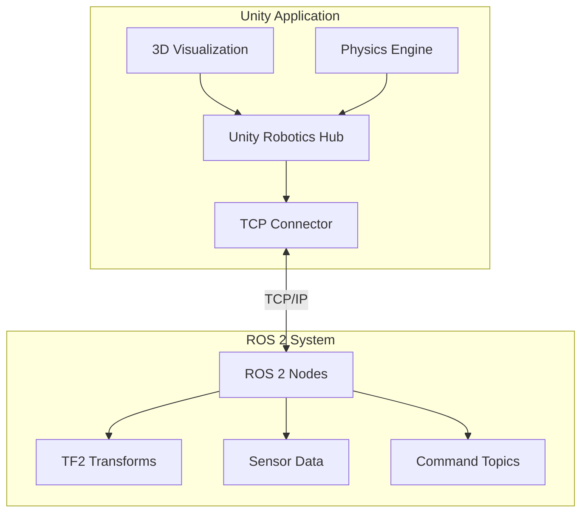
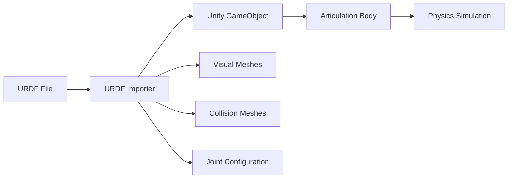

# Unity Robotics

Unity provides powerful 3D visualization and simulation capabilities that complement ROS 2 robotics development. This chapter covers the integration between Unity and ROS 2, enabling real-time visualization, digital twins, and advanced simulation scenarios.

## Why Unity for Robotics?

Unity offers several advantages for robotics development:

- **Real-time 3D Visualization**: High-quality rendering for robot visualization
- **Cross-platform Support**: Deploy to Windows, Linux, macOS, and embedded systems
- **Physics Simulation**: Built-in physics engine for realistic robot behavior
- **VR/AR Integration**: Immersive experiences for robot teleoperation
- **Large Asset Ecosystem**: Access to 3D models, environments, and tools

## Architecture Overview



## Prerequisites

Before starting with Unity Robotics, ensure you have:

- **Unity 2021.3 LTS** or later (2022.3 LTS recommended)
- **ROS 2 Humble** installed and configured
- **Unity Robotics Hub** package
- **ROS-TCP-Connector** package
- Basic familiarity with Unity Editor

### Hardware Requirements

| Component | Minimum | Recommended |
|-----------|---------|-------------|
| CPU | Intel i5 / AMD Ryzen 5 | Intel i7 / AMD Ryzen 7 |
| RAM | 8 GB | 16 GB |
| GPU | GTX 1060 / RX 580 | RTX 2060 / RX 6600 |
| Storage | 20 GB SSD | 50 GB SSD |

## Installation

### Step 1: Install Unity Hub

```bash
# Download Unity Hub from unity.com
# Or use package manager on Ubuntu:
sudo sh -c 'echo "deb https://hub.unity3d.com/linux/repos/deb stable main" > /etc/apt/sources.list.d/unityhub.list'
wget -qO - https://hub.unity3d.com/linux/keys/public | sudo apt-key add -
sudo apt update
sudo apt install unityhub
```

### Step 2: Install Unity Robotics Packages

In Unity Package Manager, add these packages:

```json
{
  "dependencies": {
    "com.unity.robotics.ros-tcp-connector": "0.7.0",
    "com.unity.robotics.urdf-importer": "0.5.2",
    "com.unity.robotics.visualizations": "0.7.0"
  }
}
```

### Step 3: Configure ROS-TCP-Endpoint

```bash
# In your ROS 2 workspace
cd ~/ros2_ws/src
git clone https://github.com/Unity-Technologies/ROS-TCP-Endpoint.git -b ROS2v0.7.0

# Build the package
cd ~/ros2_ws
colcon build --packages-select ros_tcp_endpoint
source install/setup.bash
```

## Basic Integration

### Creating a ROS Connection

```csharp
// Assets/Scripts/ROSConnection.cs
using Unity.Robotics.ROSTCPConnector;
using RosMessageTypes.Std;
using UnityEngine;

public class ROSConnectionExample : MonoBehaviour
{
    private ROSConnection ros;

    void Start()
    {
        // Initialize ROS connection
        ros = ROSConnection.GetOrCreateInstance();
        ros.Connect("127.0.0.1", 10000);

        // Subscribe to a topic
        ros.Subscribe<StringMsg>("/chatter", OnMessageReceived);
    }

    void OnMessageReceived(StringMsg msg)
    {
        Debug.Log($"Received: {msg.data}");
    }
}
```

### Publishing Messages

```csharp
// Assets/Scripts/ROSPublisher.cs
using Unity.Robotics.ROSTCPConnector;
using RosMessageTypes.Geometry;
using UnityEngine;

public class ROSPublisher : MonoBehaviour
{
    private ROSConnection ros;
    public string topicName = "/cmd_vel";

    void Start()
    {
        ros = ROSConnection.GetOrCreateInstance();
        ros.RegisterPublisher<TwistMsg>(topicName);
    }

    void Update()
    {
        if (Input.GetKey(KeyCode.W))
        {
            var twist = new TwistMsg
            {
                linear = new Vector3Msg { x = 0.5, y = 0, z = 0 },
                angular = new Vector3Msg { x = 0, y = 0, z = 0 }
            };
            ros.Publish(topicName, twist);
        }
    }
}
```

## URDF Import

Unity can import URDF robot descriptions directly:



### Import Process

1. **Window → Robotics → URDF Importer**
2. Select your `.urdf` file
3. Configure import settings:
   - **Axis Type**: Y-Up (Unity) or Z-Up (ROS)
   - **Mesh Decomposer**: VHACD for complex meshes
   - **Link Names**: Keep original or simplify

### Example: TurtleBot3 Import

```csharp
// After importing TurtleBot3 URDF
using UnityEngine;

public class TurtleBot3Controller : MonoBehaviour
{
    public ArticulationBody leftWheel;
    public ArticulationBody rightWheel;
    public float wheelRadius = 0.033f;
    public float wheelBase = 0.16f;

    public void SetVelocity(float linear, float angular)
    {
        float leftSpeed = (linear - angular * wheelBase / 2) / wheelRadius;
        float rightSpeed = (linear + angular * wheelBase / 2) / wheelRadius;

        SetWheelSpeed(leftWheel, leftSpeed);
        SetWheelSpeed(rightWheel, rightSpeed);
    }

    private void SetWheelSpeed(ArticulationBody wheel, float speed)
    {
        var drive = wheel.xDrive;
        drive.targetVelocity = speed * Mathf.Rad2Deg;
        wheel.xDrive = drive;
    }
}
```

## Sensor Simulation

### Camera Sensor

```csharp
// Assets/Scripts/Sensors/CameraSensor.cs
using Unity.Robotics.ROSTCPConnector;
using RosMessageTypes.Sensor;
using UnityEngine;

public class CameraSensor : MonoBehaviour
{
    public Camera sensorCamera;
    public string topicName = "/camera/image_raw";
    public int width = 640;
    public int height = 480;
    public float publishRate = 30f;

    private ROSConnection ros;
    private RenderTexture renderTexture;
    private Texture2D texture2D;
    private float lastPublishTime;

    void Start()
    {
        ros = ROSConnection.GetOrCreateInstance();
        ros.RegisterPublisher<ImageMsg>(topicName);

        renderTexture = new RenderTexture(width, height, 24);
        texture2D = new Texture2D(width, height, TextureFormat.RGB24, false);
        sensorCamera.targetTexture = renderTexture;
    }

    void Update()
    {
        if (Time.time - lastPublishTime >= 1f / publishRate)
        {
            PublishImage();
            lastPublishTime = Time.time;
        }
    }

    void PublishImage()
    {
        RenderTexture.active = renderTexture;
        texture2D.ReadPixels(new Rect(0, 0, width, height), 0, 0);
        texture2D.Apply();
        RenderTexture.active = null;

        var msg = new ImageMsg
        {
            height = (uint)height,
            width = (uint)width,
            encoding = "rgb8",
            step = (uint)(width * 3),
            data = texture2D.GetRawTextureData()
        };

        ros.Publish(topicName, msg);
    }
}
```

### LiDAR Sensor

```csharp
// Assets/Scripts/Sensors/LidarSensor.cs
using Unity.Robotics.ROSTCPConnector;
using RosMessageTypes.Sensor;
using UnityEngine;

public class LidarSensor : MonoBehaviour
{
    public string topicName = "/scan";
    public int numRays = 360;
    public float minAngle = 0f;
    public float maxAngle = 360f;
    public float minRange = 0.12f;
    public float maxRange = 3.5f;
    public float publishRate = 10f;

    private ROSConnection ros;
    private float[] ranges;

    void Start()
    {
        ros = ROSConnection.GetOrCreateInstance();
        ros.RegisterPublisher<LaserScanMsg>(topicName);
        ranges = new float[numRays];

        InvokeRepeating(nameof(Scan), 0f, 1f / publishRate);
    }

    void Scan()
    {
        float angleStep = (maxAngle - minAngle) / numRays;

        for (int i = 0; i < numRays; i++)
        {
            float angle = minAngle + i * angleStep;
            Vector3 direction = Quaternion.Euler(0, angle, 0) * transform.forward;

            if (Physics.Raycast(transform.position, direction, out RaycastHit hit, maxRange))
            {
                ranges[i] = Mathf.Max(hit.distance, minRange);
            }
            else
            {
                ranges[i] = maxRange;
            }
        }

        PublishScan();
    }

    void PublishScan()
    {
        var msg = new LaserScanMsg
        {
            angle_min = minAngle * Mathf.Deg2Rad,
            angle_max = maxAngle * Mathf.Deg2Rad,
            angle_increment = ((maxAngle - minAngle) / numRays) * Mathf.Deg2Rad,
            range_min = minRange,
            range_max = maxRange,
            ranges = ranges
        };

        ros.Publish(topicName, msg);
    }
}
```

## Digital Twin Applications

Unity excels at creating digital twins for:

- **Factory Automation**: Monitor and control industrial robots
- **Warehouse Simulation**: Test AGV navigation and logistics
- **Training Environments**: Safe operator training scenarios
- **Remote Monitoring**: Real-time 3D visualization of robot status

## Summary

### Key Takeaways

1. **Unity + ROS 2 Integration**: Use ROS-TCP-Connector for bidirectional communication
2. **URDF Import**: Directly import robot descriptions with physics
3. **Sensor Simulation**: Implement cameras, LiDAR, and other sensors
4. **Real-time Visualization**: High-quality 3D rendering for monitoring
5. **Digital Twins**: Create virtual replicas of physical systems

### Next Steps

- Explore [NVIDIA Isaac Sim](/docs/modules/isaac/intro) for GPU-accelerated simulation
- Learn about [Vision-Language-Action](/docs/modules/vla/intro) systems
- Build the [Capstone Project](/docs/modules/capstone/humanoid-voice-control)

## Resources

- [Unity Robotics Hub GitHub](https://github.com/Unity-Technologies/Unity-Robotics-Hub)
- [ROS-TCP-Connector Documentation](https://github.com/Unity-Technologies/ROS-TCP-Connector)
- [URDF Importer Guide](https://github.com/Unity-Technologies/URDF-Importer)
