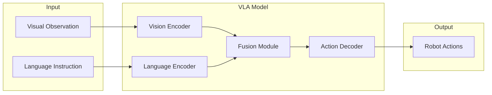
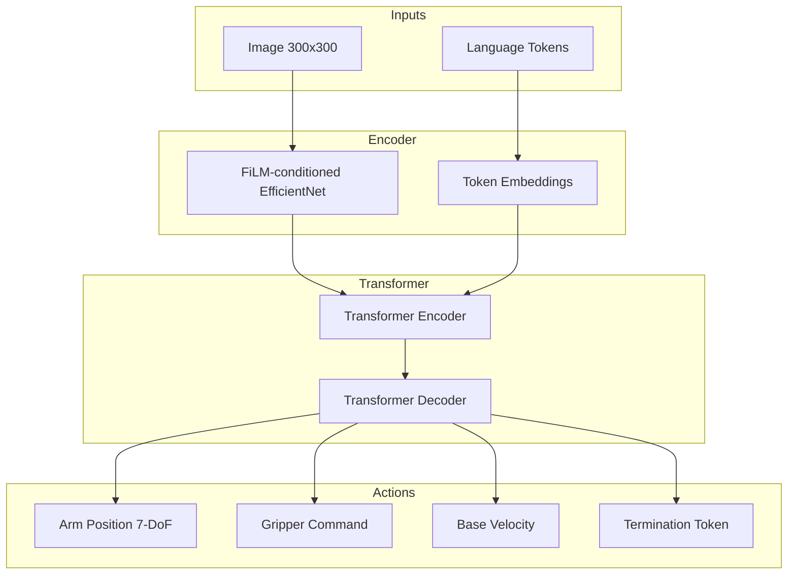
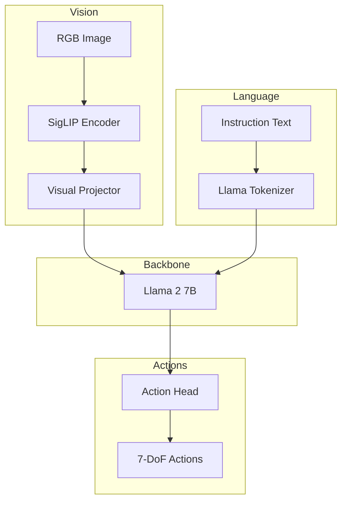
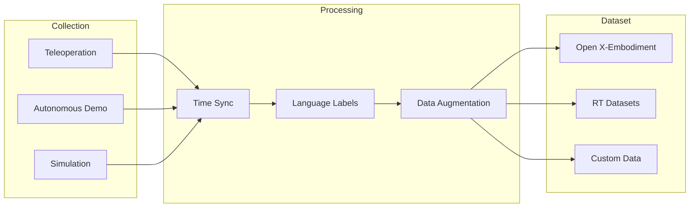

# Vision-Language-Action Systems

Vision-Language-Action (VLA) systems represent the cutting edge of robotics AI, combining computer vision, natural language processing, and action generation into unified models. This chapter explores the architectures, training methods, and deployment strategies for VLA systems.

## What are VLA Systems?

VLA models take visual observations and natural language instructions as input, and output executable robot actions. They bridge the gap between human intent and robot behavior.



## Key VLA Architectures

### RT-1 (Robotics Transformer)

Google's RT-1 demonstrated that transformer architectures can effectively map images and language to robot actions.



**Key Features:**
- **TokenLearner**: Reduces visual tokens from 81 to 8
- **Action Tokenization**: Discretizes continuous actions into 256 bins
- **Multi-task Training**: Single model for 700+ tasks

### RT-2 (Vision-Language-Action)

RT-2 leverages pre-trained vision-language models (VLMs) for improved generalization.

```python
# Conceptual RT-2 Architecture
class RT2Model:
    def __init__(self):
        self.vlm = PaLME()  # Pre-trained VLM backbone
        self.action_head = ActionTokenizer(vocab_size=256)

    def forward(self, image, instruction):
        # Encode image and instruction with VLM
        embeddings = self.vlm.encode(image, instruction)

        # Generate action tokens autoregressively
        action_tokens = self.action_head.generate(embeddings)

        # Decode to continuous actions
        actions = self.action_head.decode(action_tokens)
        return actions
```

**Advantages over RT-1:**
- **Semantic Generalization**: Understands novel objects via VLM knowledge
- **Chain-of-Thought**: Can reason about actions before executing
- **Zero-shot Transfer**: Works on unseen object categories

### OpenVLA

An open-source VLA built on Llama 2 and SigLIP:



## Action Representations

### Discrete Action Tokenization

Most VLA models discretize continuous actions:

```python
import numpy as np

class ActionTokenizer:
    def __init__(self, bins=256, action_dim=7):
        self.bins = bins
        self.action_dim = action_dim
        # Define action ranges per dimension
        self.ranges = [
            (-1.0, 1.0),  # x position
            (-1.0, 1.0),  # y position
            (0.0, 0.5),   # z position
            (-np.pi, np.pi),  # roll
            (-np.pi, np.pi),  # pitch
            (-np.pi, np.pi),  # yaw
            (0.0, 1.0),   # gripper
        ]

    def encode(self, actions):
        """Convert continuous actions to tokens."""
        tokens = []
        for i, action in enumerate(actions):
            min_val, max_val = self.ranges[i]
            normalized = (action - min_val) / (max_val - min_val)
            token = int(normalized * (self.bins - 1))
            tokens.append(np.clip(token, 0, self.bins - 1))
        return tokens

    def decode(self, tokens):
        """Convert tokens back to continuous actions."""
        actions = []
        for i, token in enumerate(tokens):
            min_val, max_val = self.ranges[i]
            normalized = token / (self.bins - 1)
            action = normalized * (max_val - min_val) + min_val
            actions.append(action)
        return np.array(actions)
```

### Continuous Action Prediction

Alternative approach using regression heads:

```python
import torch
import torch.nn as nn

class ContinuousActionHead(nn.Module):
    def __init__(self, hidden_dim=768, action_dim=7):
        super().__init__()
        self.mlp = nn.Sequential(
            nn.Linear(hidden_dim, 512),
            nn.ReLU(),
            nn.Linear(512, 256),
            nn.ReLU(),
            nn.Linear(256, action_dim),
            nn.Tanh()  # Actions in [-1, 1]
        )

    def forward(self, hidden_states):
        # Take last token's hidden state
        last_hidden = hidden_states[:, -1, :]
        actions = self.mlp(last_hidden)
        return actions
```

## Training VLA Models

### Data Collection

VLA models require large-scale robot demonstration data:



### Training Pipeline

```python
import torch
from torch.utils.data import DataLoader
from transformers import AutoModelForCausalLM

class VLATrainer:
    def __init__(self, model_name="openvla/openvla-7b"):
        self.model = AutoModelForCausalLM.from_pretrained(model_name)
        self.optimizer = torch.optim.AdamW(
            self.model.parameters(),
            lr=2e-5,
            weight_decay=0.01
        )

    def train_step(self, batch):
        images = batch["images"]
        instructions = batch["instructions"]
        actions = batch["actions"]

        # Forward pass
        outputs = self.model(
            pixel_values=images,
            input_ids=instructions,
            labels=actions
        )

        loss = outputs.loss

        # Backward pass
        self.optimizer.zero_grad()
        loss.backward()
        self.optimizer.step()

        return loss.item()

    def train(self, dataset, epochs=10, batch_size=32):
        dataloader = DataLoader(dataset, batch_size=batch_size, shuffle=True)

        for epoch in range(epochs):
            total_loss = 0
            for batch in dataloader:
                loss = self.train_step(batch)
                total_loss += loss

            avg_loss = total_loss / len(dataloader)
            print(f"Epoch {epoch+1}: Loss = {avg_loss:.4f}")
```

### Fine-tuning Strategies

**LoRA (Low-Rank Adaptation):**
```python
from peft import LoraConfig, get_peft_model

lora_config = LoraConfig(
    r=16,
    lora_alpha=32,
    target_modules=["q_proj", "v_proj", "k_proj", "o_proj"],
    lora_dropout=0.05,
    bias="none",
    task_type="CAUSAL_LM"
)

model = get_peft_model(base_model, lora_config)
# Only 0.1% of parameters are trainable
```

## Deploying VLA on Robots

### ROS 2 Integration

```python
#!/usr/bin/env python3
# vla_action_server.py

import rclpy
from rclpy.node import Node
from sensor_msgs.msg import Image
from std_msgs.msg import String
from geometry_msgs.msg import Twist
from cv_bridge import CvBridge
import torch
from transformers import AutoModelForCausalLM, AutoProcessor

class VLAActionServer(Node):
    def __init__(self):
        super().__init__('vla_action_server')

        # Load VLA model
        self.model = AutoModelForCausalLM.from_pretrained(
            "openvla/openvla-7b",
            torch_dtype=torch.float16
        ).cuda()
        self.processor = AutoProcessor.from_pretrained("openvla/openvla-7b")

        # Subscribers
        self.image_sub = self.create_subscription(
            Image, '/camera/image_raw', self.image_callback, 10
        )
        self.instruction_sub = self.create_subscription(
            String, '/vla/instruction', self.instruction_callback, 10
        )

        # Publisher
        self.action_pub = self.create_publisher(Twist, '/cmd_vel', 10)

        self.bridge = CvBridge()
        self.current_image = None
        self.current_instruction = None

    def image_callback(self, msg):
        self.current_image = self.bridge.imgmsg_to_cv2(msg, "rgb8")

    def instruction_callback(self, msg):
        self.current_instruction = msg.data
        if self.current_image is not None:
            self.generate_action()

    def generate_action(self):
        # Preprocess inputs
        inputs = self.processor(
            images=self.current_image,
            text=self.current_instruction,
            return_tensors="pt"
        ).to("cuda")

        # Generate action tokens
        with torch.no_grad():
            outputs = self.model.generate(**inputs, max_new_tokens=7)

        # Decode to action
        action = self.processor.decode(outputs[0])

        # Publish action
        twist = Twist()
        twist.linear.x = float(action[0])
        twist.angular.z = float(action[5])
        self.action_pub.publish(twist)

def main():
    rclpy.init()
    node = VLAActionServer()
    rclpy.spin(node)
    rclpy.shutdown()

if __name__ == '__main__':
    main()
```

### Inference Optimization

**TensorRT Acceleration:**
```python
import tensorrt as trt
import torch

def optimize_for_tensorrt(model, input_shape):
    """Convert PyTorch model to TensorRT for faster inference."""

    # Export to ONNX
    dummy_input = torch.randn(input_shape).cuda()
    torch.onnx.export(
        model,
        dummy_input,
        "vla_model.onnx",
        opset_version=17,
        dynamic_axes={"input": {0: "batch"}, "output": {0: "batch"}}
    )

    # Build TensorRT engine
    logger = trt.Logger(trt.Logger.WARNING)
    builder = trt.Builder(logger)
    network = builder.create_network(
        1 << int(trt.NetworkDefinitionCreationFlag.EXPLICIT_BATCH)
    )

    parser = trt.OnnxParser(network, logger)
    with open("vla_model.onnx", "rb") as f:
        parser.parse(f.read())

    config = builder.create_builder_config()
    config.set_flag(trt.BuilderFlag.FP16)

    engine = builder.build_serialized_network(network, config)

    return engine
```

## Evaluation Metrics

| Metric | Description | Target |
|--------|-------------|--------|
| Success Rate | Task completion percentage | &gt;85% |
| Generalization | Performance on novel objects | &gt;60% |
| Inference Time | Time per action prediction | &lt;100ms |
| Safety | Collision avoidance rate | &gt;99% |

## Comparison of VLA Models

| Model | Parameters | Training Data | Open Source | Generalization |
|-------|------------|---------------|-------------|----------------|
| RT-1 | 35M | 130k demos | No | Task-specific |
| RT-2 | 55B | RT-1 + web | No | Strong |
| OpenVLA | 7B | Open X-Embodiment | Yes | Good |
| Octo | 93M | Open X-Embodiment | Yes | Moderate |

## Summary

### Key Takeaways

1. **VLA Architecture**: Combines vision encoders, language models, and action decoders
2. **Action Tokenization**: Discretizing continuous actions enables transformer training
3. **Pre-trained VLMs**: Leverage web-scale knowledge for better generalization
4. **Fine-tuning**: LoRA enables efficient adaptation to new robots
5. **Deployment**: TensorRT optimization for real-time inference

### Next Steps

- Implement [Conversational Robotics](/docs/modules/conversational/intro) with Whisper
- Build the [Capstone Project](/docs/modules/capstone/humanoid-voice-control)
- Explore [NVIDIA Isaac Sim](/docs/modules/isaac/intro) for VLA training

## Resources

- [RT-1 Paper](https://arxiv.org/abs/2212.06817)
- [RT-2 Paper](https://arxiv.org/abs/2307.15818)
- [OpenVLA GitHub](https://github.com/openvla/openvla)
- [Open X-Embodiment](https://robotics-transformer-x.github.io/)
