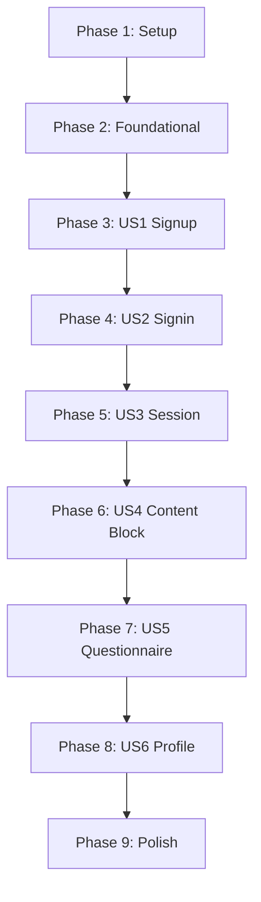

# Tasks: BetterAuth Strict Access Control

**Input**: Design documents from `/specs/001-betterauth-access-control/`
**Prerequisites**: plan.md ✓, spec.md ✓, research.md ✓, data-model.md ✓, contracts/ ✓, quickstart.md ✓
**Generated**: 2025-12-13
**Tests**: Not explicitly requested - excluded from task list

**Organization**: Tasks grouped by user story to enable independent implementation and testing.

## Format: `[ID] [P?] [Story] Description`

- **[P]**: Can run in parallel (different files, no dependencies)
- **[Story]**: Which user story this task belongs to (US1-US6 from spec)
- Include exact file paths in descriptions

## Path Conventions (Web App)

- **Backend**: `backend/src/` (FastAPI)
- **Frontend**: `src/` (Docusaurus/React)

---

## Phase 1: Setup (Shared Infrastructure)

**Purpose**: Project initialization and dependency installation

- [ ] T001 Install BetterAuth dependencies: `npm install better-auth @better-auth/react`
- [x] T002 [P] Install backend dependencies: add `bcrypt` to backend/requirements.txt
- [x] T003 [P] Add BetterAuth environment variables to backend/.env.example (BETTER_AUTH_SECRET, SESSION_EXPIRES_IN)
- [ ] T004 [P] Add frontend environment variables to .env.example (BETTER_AUTH_URL, VITE_API_URL)

---

## Phase 2: Foundational (Blocking Prerequisites)

**Purpose**: Core infrastructure that MUST be complete before ANY user story can be implemented

**⚠️ CRITICAL**: No user story work can begin until this phase is complete

- [x] T005 Create database migration script backend/src/migrations/001_betterauth_access_control.sql with User, Session, Account, Verification tables
- [x] T006 Run database migration against Neon Postgres
- [x] T007 [P] Add User SQLAlchemy model in backend/src/models/database.py
- [x] T008 [P] Add Session SQLAlchemy model in backend/src/models/database.py
- [x] T009 [P] Add Account SQLAlchemy model in backend/src/models/database.py
- [x] T010 [P] Add Verification SQLAlchemy model in backend/src/models/database.py
- [x] T011 [P] Add UserProfile SQLAlchemy model in backend/src/models/database.py
- [x] T012 [P] Create auth Pydantic models (SignUpRequest, SignInRequest, AuthResponse) in backend/src/models/auth.py
- [x] T013 [P] Create profile Pydantic models (UserProfileRequest, UserProfileResponse, QuestionnaireRequest) in backend/src/models/auth.py
- [ ] T014 Create BetterAuth client configuration in src/lib/auth-client.ts
- [x] T015 Add CORS middleware for localhost:3000 in backend/src/main.py

**Checkpoint**: Foundation ready - user story implementation can now begin

---

## Phase 3: User Story 1 - New User Signup (Priority: P1-A) 🎯 MVP

**Goal**: New users can create accounts with email/password and access content

**Independent Test**: Complete signup flow, verify user created in database, session cookie set, content accessible

### Implementation for User Story 1

- [x] T016 [US1] Create session validator service in backend/src/services/session_validator.py with get_current_user dependency
- [x] T017 [US1] Create auth service in backend/src/services/auth_service.py with password hashing (bcrypt) and session creation
- [x] T018 [US1] Add POST /api/auth/signup endpoint in backend/src/api/auth_routes.py (FR-002, FR-006, FR-007, FR-008)
- [x] T019 [US1] Implement email uniqueness validation with generic error response (FR-009) in auth_routes.py
- [ ] T020 [P] [US1] Create SignUpModal component in src/components/Auth/SignUpModal.tsx with email/password form
- [ ] T021 [US1] Add password validation (min 8 chars) to SignUpModal (FR-008)
- [ ] T022 [US1] Implement signUp.email flow in SignUpModal using auth-client.ts
- [x] T023 [US1] Set session cookie on successful signup in auth_routes.py (httpOnly, secure, sameSite=lax)
- [x] T024 [US1] Register auth_routes in backend/src/main.py

**Checkpoint**: Users can sign up with email/password, session created

---

## Phase 4: User Story 2 - Returning User Signin (Priority: P1-B)

**Goal**: Returning users can sign in with existing credentials

**Independent Test**: Sign in with valid credentials, verify session cookie set, access content

**Depends on**: US1 (users must exist to sign in)

### Implementation for User Story 2

- [x] T025 [US2] Add POST /api/auth/signin endpoint in backend/src/api/auth_routes.py (FR-003)
- [x] T026 [US2] Implement credential validation with constant-time password comparison in auth_service.py
- [x] T027 [US2] Return generic "Invalid credentials" error (no email enumeration per FR-009) in signin endpoint
- [ ] T028 [P] [US2] Create SignInModal component in src/components/Auth/SignInModal.tsx with email/password form
- [ ] T029 [US2] Implement signIn.email flow in SignInModal using auth-client.ts
- [ ] T030 [US2] Add rememberMe option to SignInModal and signin endpoint

**Checkpoint**: Users can sign in with existing accounts

---

## Phase 5: User Story 3 - Session Persistence (Priority: P1-C)

**Goal**: Sessions persist across page reloads and browser restarts (within validity)

**Independent Test**: Sign in, refresh page, verify still authenticated; close/reopen browser, verify session valid

**Depends on**: US1 (session must be created)

### Implementation for User Story 3

- [x] T031 [US3] Add GET /api/auth/session endpoint in backend/src/api/auth_routes.py (FR-004, FR-005)
- [x] T032 [US3] Implement session refresh logic in session_validator.py (extend expiration on activity)
- [x] T033 [US3] Add POST /api/auth/signout endpoint in backend/src/api/auth_routes.py (FR-010)
- [ ] T034 [P] [US3] Create AuthProvider component in src/components/Auth/AuthProvider.tsx wrapping useSession
- [ ] T035 [US3] Update src/theme/Root.tsx to wrap app with AuthProvider
- [ ] T036 [US3] Implement session persistence check on page load in AuthProvider
- [ ] T037 [US3] Add signOut method to auth-client.ts and AuthProvider

**Checkpoint**: Sessions persist correctly, signout works

---

## Phase 6: User Story 4 - Content Blocking (Priority: P1-D) 🔒 MVP Core

**Goal**: Unauthenticated users blocked from all chapter, module, and interactive content

**Independent Test**: Visit any chapter URL without auth, verify login prompt shown instead of content

**Depends on**: US3 (need session checking)

### Implementation for User Story 4

- [x] T038 [P] [US4] Create LoginPrompt component in src/components/Auth/LoginPrompt.tsx with signup/signin options
- [x] T039 [P] [US4] Create Loading component in src/components/Auth/Loading.tsx for session checking state
- [x] T040 [US4] Create ProtectedContent wrapper component in src/components/Auth/ProtectedContent.tsx
- [x] T041 [US4] Implement authentication check in ProtectedContent (show LoginPrompt if not authenticated)
- [x] T042 [US4] Create src/theme/DocItem/Content/index.tsx wrapping content with ProtectedContent
- [ ] T043 [US4] Add return URL preservation to LoginPrompt (redirect after login)
- [x] T044 [US4] Create AuthModal component in src/components/Auth/AuthModal.tsx combining SignIn/SignUp modals
- [x] T045 [US4] Add useAuth hook in src/hooks/useAuth.ts exposing signIn, signUp, signOut, session

**Checkpoint**: All content protected, unauthenticated users see login prompt

---

## Phase 7: User Story 5 - Background Questions (Priority: P2)

**Goal**: New users prompted with optional questionnaire after signup

**Independent Test**: Complete signup, verify questionnaire appears, submit or skip, verify content accessible

**Depends on**: US1 (signup flow)

### Implementation for User Story 5

- [ ] T046 [P] [US5] Create profile service in backend/src/services/profile_service.py
- [ ] T047 [P] [US5] Create profile routes in backend/src/api/profile_routes.py
- [ ] T048 [US5] Add POST /api/profile/questionnaire endpoint (FR-018, FR-020)
- [ ] T049 [US5] Add POST /api/profile/questionnaire/skip endpoint (FR-019)
- [ ] T050 [US5] Register profile_routes in backend/src/main.py
- [ ] T051 [P] [US5] Create BackgroundQuestionnaire component in src/components/Auth/BackgroundQuestionnaire.tsx
- [ ] T052 [US5] Implement questionnaire form with expertise_level, programming_languages, learning_goals
- [ ] T053 [US5] Add skip button to BackgroundQuestionnaire (FR-019)
- [ ] T054 [US5] Trigger questionnaire modal after successful signup in SignUpModal onSuccess callback (FR-018)

**Checkpoint**: Questionnaire appears after signup, can submit or skip

---

## Phase 8: User Story 6 - Personalization Integration (Priority: P2)

**Goal**: User identity available to personalization and profile systems

**Independent Test**: Authenticate, request personalization endpoint, verify user context included

**Depends on**: US5 (profile data exists)

### Implementation for User Story 6

- [ ] T055 [US6] Add GET /api/profile endpoint to return user profile (FR-016)
- [ ] T056 [US6] Add PUT /api/profile endpoint for profile updates
- [ ] T057 [US6] Add GET /api/auth/me endpoint returning full user info (FR-016, FR-017)
- [ ] T058 [P] [US6] Create ProfilePage in src/pages/profile.tsx
- [ ] T059 [US6] Display user info and profile data on ProfilePage
- [ ] T060 [US6] Add edit profile functionality to ProfilePage
- [ ] T061 [US6] Export user context from AuthProvider for use by personalization systems

**Checkpoint**: User identity flows to personalization, profile page works

---

## Phase 9: Polish & Cross-Cutting Concerns

**Purpose**: Improvements that affect multiple user stories

- [ ] T062 [P] Add comprehensive error handling across all auth routes
- [ ] T063 [P] Add structured logging for auth events (signup, signin, signout, failures)
- [ ] T064 [P] Update backend/.env.example with all required environment variables
- [ ] T065 [P] Update frontend .env.example with all required environment variables
- [ ] T066 Create auth index barrel file src/components/Auth/index.ts
- [ ] T067 Security review: verify no credential enumeration (FR-009), proper cookie flags
- [ ] T068 [P] Add user menu / auth status to navbar in src/components/Auth/AuthStatus.tsx
- [ ] T069 Performance validation: <100ms session validation, <500ms signup/signin

---

## Dependencies & Execution Order

### Phase Dependencies



### User Story Dependencies

- **US1 (Signup)**: Foundational only - No story dependencies
- **US2 (Signin)**: Depends on US1 (users must exist)
- **US3 (Session)**: Depends on US1 (session must be created)
- **US4 (Content Block)**: Depends on US3 (need session checking)
- **US5 (Questionnaire)**: Depends on US1 (signup flow)
- **US6 (Profile)**: Depends on US5 (profile data exists)

### Parallel Opportunities

**Within Phase 2 (Foundational)**:
```bash
# Models can be created in parallel:
Task T007: "Add User model"
Task T008: "Add Session model"
Task T009: "Add Account model"
Task T010: "Add Verification model"
Task T011: "Add UserProfile model"
Task T012: "Create auth Pydantic models"
Task T013: "Create profile Pydantic models"
```

**Within Phase 6 (US4 Content Block)**:
```bash
# Components can be created in parallel:
Task T038: "Create LoginPrompt component"
Task T039: "Create Loading component"
```

---

## Implementation Strategy

### MVP First (US1 + US4)

1. Complete Phase 1: Setup
2. Complete Phase 2: Foundational
3. Complete Phase 3: US1 Signup
4. Jump to Phase 6: US4 Content Blocking (partial - can test with signup only)
5. **STOP and VALIDATE**: Users can sign up and see content, non-users blocked
6. Deploy/demo basic access control

### Incremental Delivery

1. **Auth MVP** (US1 + US4): Signup + content blocking → Test → Deploy
2. **Full Auth** (US2 + US3): Signin + session persistence → Test → Deploy
3. **Personalization** (US5 + US6): Questionnaire + profile → Test → Deploy
4. **Polish**: Error handling, logging, security review → Test → Release

---

## Summary

| Phase | User Story | Tasks | Parallel Tasks |
|-------|-----------|-------|----------------|
| 1 | Setup | 4 | 3 |
| 2 | Foundational | 11 | 7 |
| 3 | US1 - Signup | 9 | 1 |
| 4 | US2 - Signin | 6 | 1 |
| 5 | US3 - Session | 7 | 1 |
| 6 | US4 - Content Block | 8 | 2 |
| 7 | US5 - Questionnaire | 9 | 2 |
| 8 | US6 - Profile | 7 | 1 |
| 9 | Polish | 8 | 5 |
| **Total** | | **69** | **23** |

**MVP Scope**: Phases 1-3 + 6 (32 tasks) - Signup + Content blocking
**Parallel Opportunities**: 23 tasks marked with [P]

---

## Notes

- [P] tasks = different files, no dependencies
- [Story] label maps task to specific user story for traceability
- Each user story checkpoint validates independent functionality
- Commit after each task or logical group
- MVP can be demonstrated after Phase 3 + partial Phase 6
