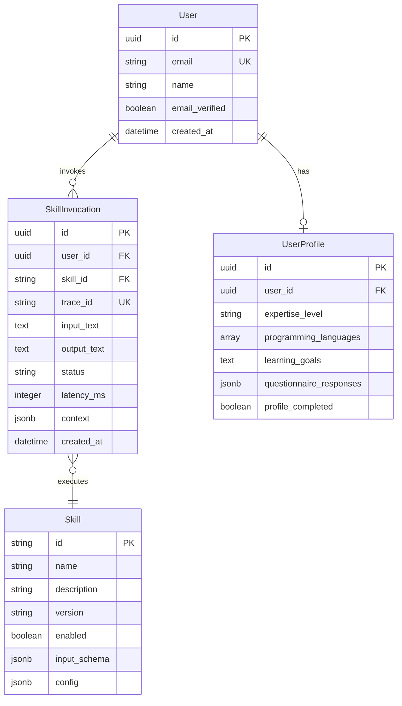

# Data Model: Reusable Intelligence with Subagents

**Feature**: 002-reusable-intelligence-subagents
**Date**: 2025-12-13
**Status**: Complete

## Entity Relationship Diagram



## Entities

### 1. Skill (Runtime Configuration)

Represents a discrete capability that can be invoked by users. Stored in code/config rather than database.

| Field | Type | Constraints | Description |
|-------|------|-------------|-------------|
| id | string | PK, unique | Skill identifier (e.g., "explain", "translate") |
| name | string | required | Human-readable name |
| description | string | required | What the skill does |
| version | string | required | Semantic version (e.g., "1.0.0") |
| enabled | boolean | default true | Whether skill is available |
| input_schema | object | required | JSON schema for input validation |
| config | object | optional | Skill-specific configuration |

**Skill Definitions**:

```yaml
skills:
  - id: "explain"
    name: "Code Explanation"
    description: "Analyzes code and generates plain-language explanations"
    version: "1.0.0"
    enabled: true
    input_schema:
      required: ["selected_text"]
      optional: ["chapter_id"]

  - id: "translate"
    name: "Urdu Translation"
    description: "Translates content to Urdu preserving technical terms"
    version: "1.0.0"
    enabled: true
    input_schema:
      required: ["selected_text"]
      optional: ["preserve_terms"]

  - id: "debug"
    name: "Debug Assistant"
    description: "Analyzes errors and provides troubleshooting guidance"
    version: "1.0.0"
    enabled: true
    input_schema:
      required: ["code_or_error"]
      optional: ["chapter_id", "error_message"]

  - id: "navigate"
    name: "Smart Navigation"
    description: "Suggests related content based on current context"
    version: "1.0.0"
    enabled: true
    input_schema:
      required: ["chapter_id"]
      optional: ["topic"]

  - id: "personalize"
    name: "Content Personalization"
    description: "Adapts content based on user profile"
    version: "1.0.0"
    enabled: true
    input_schema:
      required: ["selected_text"]
      optional: []
```

### 2. SkillInvocation (Database Table)

Records each skill invocation for logging, analytics, and debugging.

| Field | Type | Constraints | Description |
|-------|------|-------------|-------------|
| id | UUID | PK | Unique invocation identifier |
| user_id | UUID | FK → users.id, nullable | User who invoked (null if system) |
| skill_id | string | required, indexed | Which skill was invoked |
| trace_id | UUID | unique, indexed | Correlation ID for tracing |
| input_text | text | nullable | Input content (may be truncated) |
| output_text | text | nullable | Generated output |
| status | string | required | "success", "error", "timeout" |
| latency_ms | integer | nullable | Execution duration |
| context | jsonb | nullable | Full context snapshot |
| error_message | text | nullable | Error details if failed |
| created_at | timestamp | default now, indexed | When invoked |

**Note**: This table already exists as `skill_invocations` in `database.py`. Extended fields to add:
- `trace_id` (UUID, unique)
- `status` (string)
- `context` (JSONB)
- `error_message` (text)

### 3. AgentContext (Runtime Object)

Contextual information passed to skills. Not persisted directly but serialized in SkillInvocation.context.

| Field | Type | Description |
|-------|------|-------------|
| user_id | string | Authenticated user ID |
| user_email | string | User's email |
| chapter_id | string? | Current chapter identifier |
| chapter_title | string? | Current chapter title |
| selected_text | string? | User-selected content |
| user_profile | object? | User profile data for personalization |
| trace_id | string | Unique trace identifier |
| timestamp | datetime | Request timestamp |

### 4. SkillRequest (API Request Object)

Request payload for skill invocation endpoint.

| Field | Type | Constraints | Description |
|-------|------|-------------|-------------|
| skill_id | string | required | Which skill to invoke |
| input | object | required | Skill-specific input |
| input.selected_text | string? | conditional | Selected text content |
| input.code_or_error | string? | conditional | Code or error for debug |
| input.chapter_id | string? | optional | Chapter context |
| input.topic | string? | optional | Topic for navigation |

### 5. SkillResponse (API Response Object)

Response payload from skill invocation.

| Field | Type | Description |
|-------|------|-------------|
| skill_id | string | Which skill was invoked |
| trace_id | string | Correlation ID for debugging |
| result | object | Skill-specific result |
| result.content | string | Generated content/explanation |
| result.citations | array? | Related content references |
| result.suggestions | array? | Follow-up actions |
| latency_ms | integer | Processing duration |
| timestamp | datetime | Response timestamp |

## Database Migration

### Migration 003: Add Subagent Fields

```sql
-- Migration: 003_add_subagent_fields.sql
-- Extends skill_invocations table for subagent tracing

ALTER TABLE skill_invocations
ADD COLUMN IF NOT EXISTS trace_id UUID UNIQUE,
ADD COLUMN IF NOT EXISTS status VARCHAR(20) DEFAULT 'success',
ADD COLUMN IF NOT EXISTS context JSONB,
ADD COLUMN IF NOT EXISTS error_message TEXT;

-- Create index for trace lookups
CREATE INDEX IF NOT EXISTS idx_skill_invocations_trace_id
ON skill_invocations(trace_id);

-- Create index for status filtering
CREATE INDEX IF NOT EXISTS idx_skill_invocations_status
ON skill_invocations(status);

-- Create composite index for user analytics
CREATE INDEX IF NOT EXISTS idx_skill_invocations_user_skill
ON skill_invocations(user_id, skill_id, created_at DESC);
```

## Validation Rules

### SkillRequest Validation

1. `skill_id` must exist in skill registry
2. `skill_id` must be enabled
3. Input must satisfy skill's `input_schema`
4. `selected_text` max length: 5000 words
5. `code_or_error` max length: 10000 characters

### SkillInvocation Validation

1. `user_id` must be valid authenticated user (or null for system)
2. `status` must be one of: "success", "error", "timeout", "rate_limited"
3. `latency_ms` must be positive integer
4. `trace_id` must be unique UUID

## State Transitions

### SkillInvocation Lifecycle

```
┌─────────┐    invoke()    ┌────────────┐
│ (none)  │ ─────────────► │  pending   │
└─────────┘                └─────┬──────┘
                                 │
                    ┌────────────┼────────────┐
                    ▼            ▼            ▼
              ┌─────────┐  ┌─────────┐  ┌──────────┐
              │ success │  │  error  │  │ timeout  │
              └─────────┘  └─────────┘  └──────────┘
```

## Relationships to Existing Entities

### User → SkillInvocation
- One user can have many skill invocations
- `user_id` foreign key with SET NULL on delete
- Enables per-user analytics and rate limiting

### UserProfile → Personalization Skill
- Profile data (expertise_level, learning_goals) feeds personalize skill
- Read-only access through AgentContext
- No direct foreign key in skill tables

### Skill → SkillInvocation
- Each invocation references one skill by skill_id
- skill_id is string, not foreign key (skills in config, not DB)
- Enables skill version tracking in context
