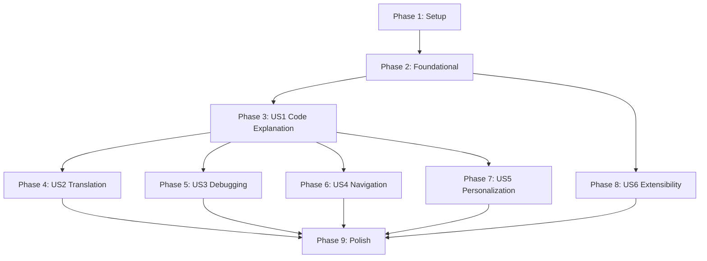

# Tasks: Reusable Intelligence with Subagents

**Input**: Design documents from `/specs/002-reusable-intelligence-subagents/`
**Prerequisites**: plan.md ✓, spec.md ✓, research.md ✓, data-model.md ✓, contracts/ ✓, quickstart.md ✓
**Generated**: 2025-12-13
**Tests**: Not explicitly requested - excluded from task list

**Organization**: Tasks grouped by user story to enable independent implementation and testing.

## Format: `[ID] [P?] [Story] Description`

- **[P]**: Can run in parallel (different files, no dependencies)
- **[Story]**: Which user story this task belongs to (US1-US6 from spec)
- Include exact file paths in descriptions

## Path Conventions (Web App)

- **Backend**: `backend/src/` (FastAPI)
- **Frontend**: `src/` (Docusaurus/React)

---

## Phase 1: Setup (Shared Infrastructure)

**Purpose**: Project initialization and dependency setup

- [x] T001 Create skills directory structure at backend/src/services/skills/
- [x] T002 [P] Create skills __init__.py at backend/src/services/skills/__init__.py
- [x] T003 [P] Create Pydantic skill models in backend/src/models/skills.py (SkillInvokeRequest, SkillInvokeResponse, SkillResult)
- [x] T004 [P] Create frontend Skills directory structure at src/components/Skills/

---

## Phase 2: Foundational (Blocking Prerequisites)

**Purpose**: Core infrastructure that MUST be complete before ANY user story can be implemented

**⚠️ CRITICAL**: No user story work can begin until this phase is complete

- [x] T005 Create database migration script backend/src/migrations/003_add_subagent_fields.py with trace_id, status, context, error_message columns
- [ ] T006 Run database migration against Neon Postgres
- [x] T007 Extend SkillInvocation SQLAlchemy model in backend/src/models/database.py with new fields (trace_id, status, context, error_message)
- [x] T008 Create BaseSkill abstract class in backend/src/services/skills/base.py with skill_id, name, description, version properties and execute() method
- [x] T009 Create AgentContext dataclass in backend/src/services/skills/base.py with user_id, user_email, chapter_id, selected_text, user_profile, trace_id, timestamp
- [x] T010 Create SkillResult dataclass in backend/src/services/skills/base.py with content, citations, suggestions fields
- [x] T011 Create SkillRegistry class in backend/src/services/skills/registry.py with register(), get(), list_all(), is_registered() methods
- [x] T012 Create global skill_registry singleton in backend/src/services/skills/registry.py
- [x] T013 Create AgentOrchestrator class in backend/src/services/agent_orchestrator.py with invoke_skill() and _log_invocation() methods
- [x] T014 Create skills_routes.py router in backend/src/api/skills_routes.py with /api/skills prefix
- [x] T015 Add POST /api/skills/invoke endpoint in backend/src/api/skills_routes.py (FR-010, FR-012)
- [x] T016 Add GET /api/skills endpoint in backend/src/api/skills_routes.py to list available skills
- [x] T017 Add GET /api/skills/history endpoint in backend/src/api/skills_routes.py for invocation history
- [x] T018 Add GET /api/skills/{trace_id} endpoint in backend/src/api/skills_routes.py for invocation details
- [x] T019 Add authentication dependency (get_session) to all skills_routes endpoints (FR-013, FR-014)
- [x] T020 Register skills_routes in backend/src/main.py
- [x] T021 [P] Create frontend Skills API client in src/components/Skills/api.ts with invokeSkill(), listSkills(), getHistory() functions
- [x] T022 [P] Add credentials: 'include' to all skill API calls for authentication
- [x] T023 [P] Create AuthenticationError class in src/components/Skills/api.ts for 401 handling

**Checkpoint**: Foundation ready - user story implementation can now begin

---

## Phase 3: User Story 1 - Code Explanation (Priority: P1-A) 🎯 MVP

**Goal**: Readers can select code and receive plain-language explanations

**Independent Test**: Select any code block, invoke "Explain", receive accurate explanation within 5 seconds

### Implementation for User Story 1

- [x] T024 [US1] Create ExplainSkill class in backend/src/services/skills/explain_skill.py implementing BaseSkill
- [x] T025 [US1] Implement ExplainSkill.execute() with code analysis prompt using GeminiService
- [x] T026 [US1] Add input validation for selected_text in ExplainSkill (max 5000 words)
- [x] T027 [US1] Register ExplainSkill with skill_registry in backend/src/services/skills/__init__.py
- [x] T028 [P] [US1] Create SkillPanel component in src/components/Skills/SkillPanel.tsx with skill buttons and result display
- [x] T029 [US1] Add "Explain Code" button to SkillPanel that invokes explain skill
- [x] T030 [US1] Display explanation result with loading state in SkillPanel
- [x] T031 [US1] Add authentication check in SkillPanel (show login prompt if not authenticated)
- [x] T032 [P] [US1] Create SkillResult component in src/components/Skills/SkillResult.tsx for displaying skill output
- [x] T033 [US1] Add trace_id display in SkillResult for debugging
- [x] T034 [P] [US1] Create useSkill hook in src/hooks/useSkill.ts for skill invocation state management
- [x] T035 [US1] Integrate SkillPanel with text selection in src/theme/DocItem/index.tsx

**Checkpoint**: Users can explain code blocks - MVP complete

---

## Phase 4: User Story 2 - Content Translation (Priority: P1-B)

**Goal**: Readers can translate content to Urdu while preserving technical terms

**Independent Test**: Select text, invoke "Translate", receive Urdu translation with technical terms preserved

**Depends on**: US1 (shared SkillPanel infrastructure)

### Implementation for User Story 2

- [ ] T036 [US2] Create TranslateSkill class in backend/src/services/skills/translate_skill.py implementing BaseSkill
- [ ] T037 [US2] Implement TranslateSkill.execute() with Urdu translation prompt preserving technical terms
- [ ] T038 [US2] Add preserve_terms parameter support in TranslateSkill input
- [ ] T039 [US2] Register TranslateSkill with skill_registry in backend/src/services/skills/__init__.py
- [ ] T040 [US2] Add "Translate" button to SkillPanel in src/components/Skills/SkillPanel.tsx
- [ ] T041 [US2] Handle translation result display with RTL support for Urdu in SkillResult

**Checkpoint**: Users can translate content to Urdu

---

## Phase 5: User Story 3 - Debugging Assistance (Priority: P1-C)

**Goal**: Readers can get help debugging errors in their code

**Independent Test**: Paste error message, invoke "Debug", receive actionable fix suggestions within 5 seconds

**Depends on**: US1 (shared SkillPanel infrastructure)

### Implementation for User Story 3

- [ ] T042 [US3] Create DebugSkill class in backend/src/services/skills/debug_skill.py implementing BaseSkill
- [ ] T043 [US3] Implement DebugSkill.execute() with error analysis and fix suggestions prompt
- [ ] T044 [US3] Add code_or_error and error_message input parameters to DebugSkill
- [ ] T045 [US3] Include chapter context references in debug responses
- [ ] T046 [US3] Register DebugSkill with skill_registry in backend/src/services/skills/__init__.py
- [ ] T047 [US3] Add "Debug" button to SkillPanel in src/components/Skills/SkillPanel.tsx
- [ ] T048 [US3] Add error input field for manual error pasting in SkillPanel

**Checkpoint**: Users can get debugging assistance

---

## Phase 6: User Story 4 - Smart Navigation (Priority: P2-A)

**Goal**: Readers can discover related content across the book

**Independent Test**: Invoke navigation from any chapter, receive relevant cross-references

**Depends on**: US1 (shared infrastructure)

### Implementation for User Story 4

- [ ] T049 [US4] Create NavigateSkill class in backend/src/services/skills/navigate_skill.py implementing BaseSkill
- [ ] T050 [US4] Implement NavigateSkill.execute() with related content discovery prompt
- [ ] T051 [US4] Add chapter_id and topic input parameters to NavigateSkill
- [ ] T052 [US4] Return citations with chapter links in NavigateSkill response
- [ ] T053 [US4] Register NavigateSkill with skill_registry in backend/src/services/skills/__init__.py
- [ ] T054 [US4] Add "Find Related" button to SkillPanel in src/components/Skills/SkillPanel.tsx
- [ ] T055 [US4] Display navigation suggestions as clickable links in SkillResult

**Checkpoint**: Users can navigate to related content

---

## Phase 7: User Story 5 - Personalized Content (Priority: P2-B)

**Goal**: Content adapted to reader's expertise level based on profile

**Independent Test**: Users with different profiles receive appropriately adapted explanations

**Depends on**: US1 (shared infrastructure), UserProfile from 001-betterauth

### Implementation for User Story 5

- [ ] T056 [US5] Create PersonalizeSkill class in backend/src/services/skills/personalize_skill.py implementing BaseSkill
- [ ] T057 [US5] Implement PersonalizeSkill.execute() with expertise-level adaptation prompt
- [ ] T058 [US5] Fetch user profile data in AgentOrchestrator before invoking PersonalizeSkill
- [ ] T059 [US5] Include expertise_level and learning_goals in personalization prompt
- [ ] T060 [US5] Register PersonalizeSkill with skill_registry in backend/src/services/skills/__init__.py
- [ ] T061 [US5] Add "Personalize" button to SkillPanel in src/components/Skills/SkillPanel.tsx
- [ ] T062 [US5] Show personalization indicator when content is adapted

**Checkpoint**: Users receive personalized explanations

---

## Phase 8: User Story 6 - Extensibility (Priority: P3)

**Goal**: Developers can add new skills without modifying existing code

**Independent Test**: Add a test skill following documentation, verify it works

**Depends on**: All infrastructure (Phase 2)

### Implementation for User Story 6

- [ ] T063 [US6] Create skill template documentation in backend/src/services/skills/README.md
- [ ] T064 [US6] Document skill interface requirements (BaseSkill implementation)
- [ ] T065 [US6] Document skill registration process
- [ ] T066 [US6] Add skill versioning support in SkillRegistry
- [ ] T067 [US6] Create example skill (QuizGeneratorSkill) in backend/src/services/skills/examples/quiz_skill.py
- [ ] T068 [US6] Verify example skill can be added without modifying existing skills

**Checkpoint**: Developers can extend the skill system

---

## Phase 9: Polish & Cross-Cutting Concerns

**Purpose**: Improvements that affect multiple user stories

- [ ] T069 [P] Add comprehensive error handling across all skill routes with proper HTTP status codes
- [x] T070 [P] Add structured logging for skill invocations (timestamp, user_id, skill_id, status, latency_ms)
- [x] T071 [P] Implement trace_id generation and propagation in AgentOrchestrator
- [ ] T072 [P] Add rate limiting to skill invocation endpoint (FR-016, FR-017, FR-018)
- [x] T073 [P] Create Skills barrel export in src/components/Skills/index.ts
- [x] T074 Add graceful error display in SkillPanel for failed invocations
- [x] T075 Add loading states to all skill buttons
- [ ] T076 [P] Update backend/.env.example with any new environment variables
- [ ] T077 Security review: verify authentication required for all skill endpoints (FR-013, FR-014)
- [ ] T078 Performance validation: verify <5s response time for skill invocations (SC-001)

---

## Dependencies & Execution Order

### Phase Dependencies



### User Story Dependencies

- **US1 (Code Explanation)**: Foundational only - No story dependencies (**MVP**)
- **US2 (Translation)**: Depends on US1 (shared SkillPanel)
- **US3 (Debugging)**: Depends on US1 (shared SkillPanel)
- **US4 (Navigation)**: Depends on US1 (shared infrastructure)
- **US5 (Personalization)**: Depends on US1 + 001-betterauth UserProfile
- **US6 (Extensibility)**: Depends on Phase 2 (Foundational only)

### Parallel Opportunities

**Within Phase 2 (Foundational)**:
```bash
# Can run in parallel after T007:
Task T008: "Create BaseSkill abstract class" [P]
Task T009: "Create AgentContext dataclass" [P]
Task T010: "Create SkillResult dataclass" [P]

# Can run in parallel after T014:
Task T021: "Create frontend Skills API client" [P]
Task T022: "Add credentials to API calls" [P]
Task T023: "Create AuthenticationError class" [P]
```

**Within Phase 3 (US1)**:
```bash
# Can run in parallel after backend skill is ready:
Task T028: "Create SkillPanel component" [P]
Task T032: "Create SkillResult component" [P]
Task T034: "Create useSkill hook" [P]
```

---

## Implementation Strategy

### MVP First (US1 Only)

1. Complete Phase 1: Setup
2. Complete Phase 2: Foundational
3. Complete Phase 3: US1 Code Explanation
4. **STOP and VALIDATE**: Users can select code and get explanations
5. Deploy/demo basic skill functionality

### Incremental Delivery

1. **Skill MVP** (US1): Explain skill + SkillPanel → Test → Deploy
2. **Core Skills** (US2 + US3): Translation + Debug → Test → Deploy
3. **Advanced Skills** (US4 + US5): Navigation + Personalization → Test → Deploy
4. **Extensibility** (US6): Documentation + Examples → Test → Release
5. **Polish**: Error handling, logging, performance → Test → Release

---

## Summary

| Phase | User Story | Tasks | Parallel Tasks |
|-------|-----------|-------|----------------|
| 1 | Setup | 4 | 3 |
| 2 | Foundational | 19 | 6 |
| 3 | US1 - Code Explanation | 12 | 3 |
| 4 | US2 - Translation | 6 | 0 |
| 5 | US3 - Debugging | 7 | 0 |
| 6 | US4 - Navigation | 7 | 0 |
| 7 | US5 - Personalization | 7 | 0 |
| 8 | US6 - Extensibility | 6 | 0 |
| 9 | Polish | 10 | 5 |
| **Total** | | **78** | **17** |

**MVP Scope**: Phases 1-3 (35 tasks) - Setup + Foundational + Code Explanation
**Parallel Opportunities**: 17 tasks marked with [P]

---

## Notes

- [P] tasks = different files, no dependencies
- [Story] label maps task to specific user story for traceability
- Each user story checkpoint validates independent functionality
- Commit after each task or logical group
- MVP can be demonstrated after Phase 3
- Tests not included (not explicitly requested in spec)
