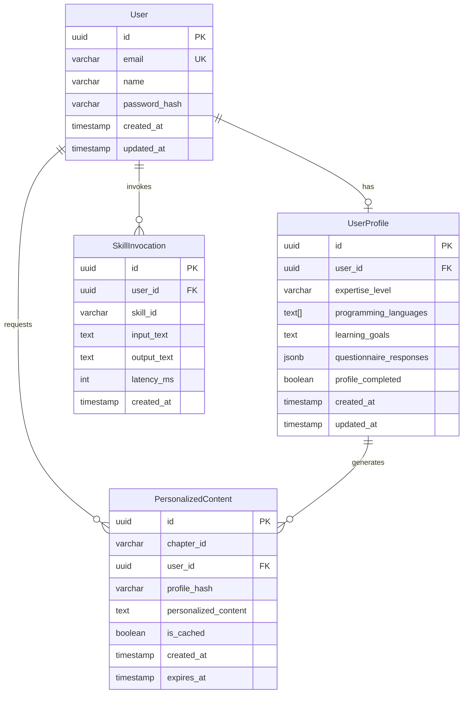

# Data Model: Intelligent Personalization & Authentication

**Feature**: intelligent-personalization-auth
**Date**: 2025-12-09
**Database**: Neon Serverless Postgres

## Entity Relationship Diagram



## Tables

### 1. users

Stores authenticated user information.

| Column | Type | Constraints | Description |
|--------|------|-------------|-------------|
| id | UUID | PK, DEFAULT gen_random_uuid() | Unique identifier |
| email | VARCHAR(255) | UNIQUE, NOT NULL | User email address |
| name | VARCHAR(255) | | Display name |
| password_hash | VARCHAR(255) | NOT NULL | Bcrypt hashed password |
| created_at | TIMESTAMP WITH TIME ZONE | DEFAULT NOW() | Account creation time |
| updated_at | TIMESTAMP WITH TIME ZONE | DEFAULT NOW() | Last update time |

**Indexes**:
- `idx_users_email` on `email` (for login lookups)

**SQLAlchemy Model**:
```python
class User(Base):
    __tablename__ = 'users'

    id = Column(UUID(as_uuid=True), primary_key=True, default=uuid.uuid4)
    email = Column(String(255), unique=True, nullable=False, index=True)
    name = Column(String(255))
    password_hash = Column(String(255), nullable=False)
    created_at = Column(DateTime(timezone=True), default=datetime.utcnow)
    updated_at = Column(DateTime(timezone=True), default=datetime.utcnow, onupdate=datetime.utcnow)

    # Relationships
    profile = relationship("UserProfile", back_populates="user", uselist=False)
```

---

### 2. user_profiles

Stores user background and expertise information.

| Column | Type | Constraints | Description |
|--------|------|-------------|-------------|
| id | UUID | PK, DEFAULT gen_random_uuid() | Unique identifier |
| user_id | UUID | FK → users.id, UNIQUE | Owner user |
| expertise_level | VARCHAR(20) | DEFAULT 'intermediate' | beginner/intermediate/expert |
| programming_languages | TEXT[] | | Array of known languages |
| learning_goals | TEXT | | User's learning objectives |
| questionnaire_responses | JSONB | | Full questionnaire answers |
| profile_completed | BOOLEAN | DEFAULT FALSE | Whether onboarding completed |
| created_at | TIMESTAMP WITH TIME ZONE | DEFAULT NOW() | Profile creation time |
| updated_at | TIMESTAMP WITH TIME ZONE | DEFAULT NOW() | Last update time |

**Indexes**:
- `idx_user_profiles_user_id` on `user_id`
- `idx_user_profiles_expertise` on `expertise_level`

**SQLAlchemy Model**:
```python
class UserProfile(Base):
    __tablename__ = 'user_profiles'

    id = Column(UUID(as_uuid=True), primary_key=True, default=uuid.uuid4)
    user_id = Column(UUID(as_uuid=True), ForeignKey('users.id', ondelete='CASCADE'), unique=True)
    expertise_level = Column(String(20), default='intermediate')
    programming_languages = Column(ARRAY(Text), default=[])
    learning_goals = Column(Text)
    questionnaire_responses = Column(JSONB)
    profile_completed = Column(Boolean, default=False)
    created_at = Column(DateTime(timezone=True), default=datetime.utcnow)
    updated_at = Column(DateTime(timezone=True), default=datetime.utcnow, onupdate=datetime.utcnow)

    # Relationships
    user = relationship("User", back_populates="profile")
```

**Questionnaire JSONB Schema**:
```json
{
  "version": 1,
  "completed_at": "2025-12-09T10:00:00Z",
  "answers": {
    "programming_experience_years": 3,
    "robotics_experience": "none|hobbyist|professional",
    "primary_interest": "simulation|hardware|ai|all",
    "preferred_learning_style": "examples|theory|projects",
    "time_commitment": "casual|moderate|intensive"
  }
}
```

---

### 3. personalized_content

Caches personalized chapter content.

| Column | Type | Constraints | Description |
|--------|------|-------------|-------------|
| id | UUID | PK, DEFAULT gen_random_uuid() | Unique identifier |
| chapter_id | VARCHAR(100) | NOT NULL | Chapter identifier (e.g., "ros2-fundamentals") |
| user_id | UUID | FK → users.id | User who requested |
| profile_hash | VARCHAR(16) | NOT NULL | Hash of profile for caching |
| personalized_content | TEXT | NOT NULL | Adapted content |
| is_cached | BOOLEAN | DEFAULT TRUE | Whether from cache |
| created_at | TIMESTAMP WITH TIME ZONE | DEFAULT NOW() | Generation time |
| expires_at | TIMESTAMP WITH TIME ZONE | | Cache expiration |

**Indexes**:
- `idx_personalized_chapter_hash` on `(chapter_id, profile_hash)` - for cache lookups
- `idx_personalized_user` on `user_id`

**SQLAlchemy Model**:
```python
class PersonalizedContent(Base):
    __tablename__ = 'personalized_content'

    id = Column(UUID(as_uuid=True), primary_key=True, default=uuid.uuid4)
    chapter_id = Column(String(100), nullable=False, index=True)
    user_id = Column(UUID(as_uuid=True), ForeignKey('users.id', ondelete='SET NULL'))
    profile_hash = Column(String(16), nullable=False)
    personalized_content = Column(Text, nullable=False)
    is_cached = Column(Boolean, default=True)
    created_at = Column(DateTime(timezone=True), default=datetime.utcnow)
    expires_at = Column(DateTime(timezone=True))

    __table_args__ = (
        Index('idx_personalized_chapter_hash', 'chapter_id', 'profile_hash'),
    )
```

---

### 4. skill_invocations

Logs agent skill usage for analytics.

| Column | Type | Constraints | Description |
|--------|------|-------------|-------------|
| id | UUID | PK, DEFAULT gen_random_uuid() | Unique identifier |
| user_id | UUID | FK → users.id | User who invoked |
| skill_id | VARCHAR(50) | NOT NULL | Skill identifier |
| input_text | TEXT | | Input provided |
| output_text | TEXT | | Generated output |
| latency_ms | INTEGER | | Response time |
| created_at | TIMESTAMP WITH TIME ZONE | DEFAULT NOW() | Invocation time |

**Indexes**:
- `idx_skill_invocations_user` on `user_id`
- `idx_skill_invocations_skill` on `skill_id`

**SQLAlchemy Model**:
```python
class SkillInvocation(Base):
    __tablename__ = 'skill_invocations'

    id = Column(UUID(as_uuid=True), primary_key=True, default=uuid.uuid4)
    user_id = Column(UUID(as_uuid=True), ForeignKey('users.id', ondelete='SET NULL'))
    skill_id = Column(String(50), nullable=False, index=True)
    input_text = Column(Text)
    output_text = Column(Text)
    latency_ms = Column(Integer)
    created_at = Column(DateTime(timezone=True), default=datetime.utcnow, index=True)
```

---

## Pydantic Models

### Request/Response Models

```python
# backend/src/models/auth.py
from pydantic import BaseModel, EmailStr
from typing import Optional, List
from datetime import datetime
from enum import Enum

class ExpertiseLevel(str, Enum):
    BEGINNER = "beginner"
    INTERMEDIATE = "intermediate"
    EXPERT = "expert"

class SignUpRequest(BaseModel):
    email: EmailStr
    password: str
    name: Optional[str] = None

class SignInRequest(BaseModel):
    email: EmailStr
    password: str

class AuthResponse(BaseModel):
    user_id: str
    email: str
    name: Optional[str]
    token: str
    profile_completed: bool

class UserProfileRequest(BaseModel):
    expertise_level: ExpertiseLevel
    programming_languages: List[str]
    learning_goals: Optional[str]
    questionnaire_responses: Optional[dict]

class UserProfileResponse(BaseModel):
    user_id: str
    expertise_level: ExpertiseLevel
    programming_languages: List[str]
    learning_goals: Optional[str]
    profile_completed: bool
    updated_at: datetime
```

```python
# backend/src/models/personalization.py
from pydantic import BaseModel
from typing import Optional
from datetime import datetime

class PersonalizeRequest(BaseModel):
    chapter_id: str
    content: str

class PersonalizeResponse(BaseModel):
    chapter_id: str
    personalized_content: str
    profile_hash: str
    cached: bool
    latency_ms: int

class SkillRequest(BaseModel):
    skill_id: str
    input_text: str
    chapter_context: Optional[str] = None

class SkillResponse(BaseModel):
    skill_id: str
    output: str
    latency_ms: int
```

---

## Migration Script

```sql
-- Migration: 001_add_auth_personalization.sql

-- Users table
CREATE TABLE IF NOT EXISTS users (
    id UUID PRIMARY KEY DEFAULT gen_random_uuid(),
    email VARCHAR(255) UNIQUE NOT NULL,
    name VARCHAR(255),
    password_hash VARCHAR(255) NOT NULL,
    created_at TIMESTAMP WITH TIME ZONE DEFAULT NOW(),
    updated_at TIMESTAMP WITH TIME ZONE DEFAULT NOW()
);

CREATE INDEX IF NOT EXISTS idx_users_email ON users(email);

-- User profiles table
CREATE TABLE IF NOT EXISTS user_profiles (
    id UUID PRIMARY KEY DEFAULT gen_random_uuid(),
    user_id UUID UNIQUE REFERENCES users(id) ON DELETE CASCADE,
    expertise_level VARCHAR(20) DEFAULT 'intermediate',
    programming_languages TEXT[] DEFAULT '{}',
    learning_goals TEXT,
    questionnaire_responses JSONB,
    profile_completed BOOLEAN DEFAULT FALSE,
    created_at TIMESTAMP WITH TIME ZONE DEFAULT NOW(),
    updated_at TIMESTAMP WITH TIME ZONE DEFAULT NOW()
);

CREATE INDEX IF NOT EXISTS idx_user_profiles_user_id ON user_profiles(user_id);
CREATE INDEX IF NOT EXISTS idx_user_profiles_expertise ON user_profiles(expertise_level);

-- Personalized content cache table
CREATE TABLE IF NOT EXISTS personalized_content (
    id UUID PRIMARY KEY DEFAULT gen_random_uuid(),
    chapter_id VARCHAR(100) NOT NULL,
    user_id UUID REFERENCES users(id) ON DELETE SET NULL,
    profile_hash VARCHAR(16) NOT NULL,
    personalized_content TEXT NOT NULL,
    is_cached BOOLEAN DEFAULT TRUE,
    created_at TIMESTAMP WITH TIME ZONE DEFAULT NOW(),
    expires_at TIMESTAMP WITH TIME ZONE
);

CREATE INDEX IF NOT EXISTS idx_personalized_chapter_hash
    ON personalized_content(chapter_id, profile_hash);
CREATE INDEX IF NOT EXISTS idx_personalized_user ON personalized_content(user_id);

-- Skill invocations log table
CREATE TABLE IF NOT EXISTS skill_invocations (
    id UUID PRIMARY KEY DEFAULT gen_random_uuid(),
    user_id UUID REFERENCES users(id) ON DELETE SET NULL,
    skill_id VARCHAR(50) NOT NULL,
    input_text TEXT,
    output_text TEXT,
    latency_ms INTEGER,
    created_at TIMESTAMP WITH TIME ZONE DEFAULT NOW()
);

CREATE INDEX IF NOT EXISTS idx_skill_invocations_user ON skill_invocations(user_id);
CREATE INDEX IF NOT EXISTS idx_skill_invocations_skill ON skill_invocations(skill_id);
CREATE INDEX IF NOT EXISTS idx_skill_invocations_created ON skill_invocations(created_at);
```

---

## Validation Rules

| Entity | Field | Rule |
|--------|-------|------|
| User | email | Valid email format, max 255 chars |
| User | password | Min 8 chars, stored as bcrypt hash |
| UserProfile | expertise_level | Must be: beginner, intermediate, expert |
| UserProfile | programming_languages | Max 20 items, each max 50 chars |
| PersonalizedContent | chapter_id | Alphanumeric with dashes, max 100 chars |
| PersonalizedContent | profile_hash | Exactly 16 hex characters |
| SkillInvocation | skill_id | Must exist in skill registry |
