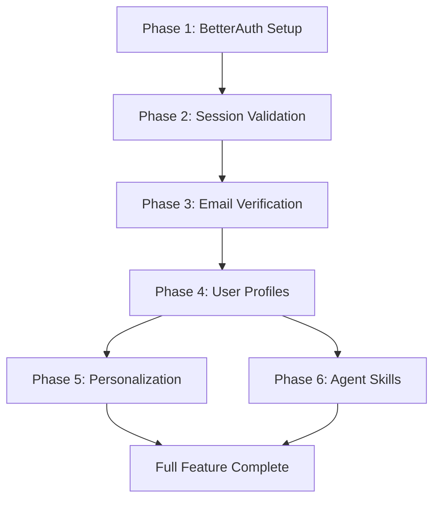

# Implementation Plan: Intelligent Personalization & Authentication

**Branch**: `intelligent-personalization-auth` | **Date**: 2025-12-09 (Updated: 2025-12-12) | **Spec**: [spec.md](./spec.md)
**Input**: Feature specification from `/specs/intelligent-personalization-auth/spec.md`

## Summary

Implement a five-tier feature set for the Physical AI & Humanoid Robotics book:
1. **BetterAuth** integration for user authentication (email/password with email verification)
2. **Secure Session Handling** with cookie-based tokens and automatic refresh
3. **User Profile System** with background questionnaire and expertise tracking
4. **Content Personalization** using Gemini API to adapt chapter content based on user profiles
5. **Agent Skills** for reusable AI-powered content interactions

### Key Clarifications (2025-12-12)
- **Password Policy**: Minimum 8 characters, no complexity requirements (FR-025)
- **Email Verification**: Required before accessing personalization features (FR-026)
- **Integration Pattern**: BetterAuth runs client-side in Docusaurus; FastAPI validates session cookies directly using shared secret (FR-027)

## Technical Context

**Language/Version**: Python 3.13 (backend), TypeScript 5.6 (frontend)
**Primary Dependencies**:
- Backend: FastAPI, SQLAlchemy, asyncpg, google-generativeai
- Frontend: React 18, Docusaurus 3.5, better-auth (new)
**Storage**: Neon Serverless Postgres (existing), localStorage (client cache)
**Testing**: pytest (backend), manual testing (frontend - no existing test infra)
**Target Platform**: Web (Docusaurus static site + FastAPI backend)
**Project Type**: Web application (frontend + backend)
**Performance Goals**:
- Auth operations: <500ms
- Personalization: <30s (new), <10s (cached)
- Agent Skills: <5s response
**Constraints**:
- Free tier limits (Neon: 0.5GB, Qdrant: 1GB)
- Gemini API rate limits (15 RPM free tier)
- No OAuth initially (email/password only)
**Scale/Scope**: Single user sessions, ~20 chapters, ~5 concurrent users

## Constitution Check

*GATE: Must pass before Phase 0 research. Re-check after Phase 1 design.*

| Principle | Status | Notes |
|-----------|--------|-------|
| I. Accuracy and Reliability | ✅ PASS | Personalization uses LLM but preserves code blocks/diagrams |
| II. Modular, Spec-Driven Development | ✅ PASS | Spec created, plan in progress |
| III. Maintainability and Clarity | ✅ PASS | Clear separation: auth service, profile service, personalization service |
| IV. End-to-End Consistency | ✅ PASS | Same patterns as existing translation/chatbot services |
| V. Security and Privacy | ✅ PASS | Better Auth handles password hashing, session management |

**Key Standards Compliance:**
- Free tier compatible: ✅ (Better Auth is MIT licensed, uses existing Postgres)
- Zero broken links: ✅ (no new routes that could break)
- API Standards: ✅ (follows existing FastAPI patterns)

## Project Structure

### Documentation (this feature)

```text
specs/intelligent-personalization-auth/
├── plan.md              # This file
├── research.md          # Phase 0 output
├── data-model.md        # Phase 1 output
├── quickstart.md        # Phase 1 output
├── contracts/           # Phase 1 output
│   └── api-openapi.yaml
└── tasks.md             # Phase 2 output (from /sp.tasks)
```

### Source Code (repository root)

```text
backend/
├── src/
│   ├── models/
│   │   ├── database.py        # Existing - ADD: User, UserProfile tables
│   │   ├── auth.py            # NEW: Auth-related Pydantic models
│   │   └── personalization.py # NEW: Personalization models
│   ├── services/
│   │   ├── auth_service.py         # NEW: Better Auth integration wrapper
│   │   ├── profile_service.py      # NEW: User profile management
│   │   ├── personalization_service.py # NEW: Content personalization
│   │   └── skills_service.py       # NEW: Agent Skills registry
│   └── api/
│       ├── auth_routes.py          # NEW: /api/auth/* endpoints
│       ├── profile_routes.py       # NEW: /api/profile/* endpoints
│       └── personalization_routes.py # NEW: /api/personalize/* endpoints
└── tests/
    └── unit/
        └── test_personalization.py # NEW

src/
├── components/
│   ├── Auth/                    # NEW
│   │   ├── AuthProvider.tsx     # Better Auth context
│   │   ├── SignInModal.tsx      # Sign in form
│   │   ├── SignUpModal.tsx      # Sign up form
│   │   └── BackgroundQuestionnaire.tsx # Onboarding
│   ├── Personalization/         # NEW
│   │   ├── PersonalizeButton.tsx    # Toggle button
│   │   └── PersonalizedContent.tsx  # Content wrapper
│   └── AgentSkills/             # NEW
│       ├── SkillsPanel.tsx      # Skills interface
│       └── CodeExplainer.tsx    # Code explanation overlay
└── theme/
    └── Root.tsx                 # MODIFY: Add AuthProvider wrapper
```

**Structure Decision**: Web application pattern with separated frontend/backend. Auth is handled client-side with Better Auth, backend provides profile storage and personalization API.

## Architecture Decisions

### AD-1: BetterAuth Integration Pattern (Updated 2025-12-12)
**Decision**: BetterAuth runs client-side in Docusaurus; FastAPI validates session cookies directly
**Rationale**:
- Framework-agnostic, works with React/Docusaurus
- Built-in session management with cookie-based tokens (compact encoding)
- FastAPI validates cookies using shared BETTER_AUTH_SECRET
- No separate Node.js service needed
- Session expiration: 7 days, refresh interval: 1 day
- Cookie caching enabled for <50ms validation latency

**Cookie Validation Pattern**:
```python
# FastAPI validates BetterAuth session cookies directly
import hmac
import base64

def validate_session_cookie(cookie: str, secret: str) -> dict:
    # BetterAuth compact encoding: base64url + HMAC-SHA256
    payload, signature = cookie.rsplit('.', 1)
    expected_sig = hmac.new(secret.encode(), payload.encode(), 'sha256').digest()
    if not hmac.compare_digest(base64.urlsafe_b64decode(signature), expected_sig):
        raise HTTPException(401, "Invalid session")
    return json.loads(base64.urlsafe_b64decode(payload))
```

### AD-2: Personalization Strategy
**Decision**: Full chapter rewrite via Gemini API with caching
**Rationale**:
- Simpler than per-paragraph adaptation
- Can leverage existing Gemini service
- Cache by (chapter_id, profile_hash) to reduce API calls
- User can toggle between original and personalized

### AD-3: Profile Storage
**Decision**: Store profiles in existing Neon Postgres
**Rationale**:
- Already configured and connected
- Simpler than adding new database
- Profile data is small (<1KB per user)

### AD-4: Agent Skills Implementation
**Decision**: Start with prompt engineering, not Claude Agent SDK
**Rationale**:
- Claude Agent SDK adds complexity
- Gemini API already integrated
- Can achieve 80% of value with well-crafted prompts
- Upgrade path to SDK exists if needed

### AD-5: Password Policy (Added 2025-12-12)
**Decision**: Basic password policy - minimum 8 characters, no complexity requirements
**Rationale**:
- Balances security with user experience
- Aligns with modern NIST guidance favoring length over complexity
- Reduces signup friction for educational platform
- BetterAuth handles hashing (bcrypt)

### AD-6: Email Verification Flow (Added 2025-12-12)
**Decision**: Email verification required before accessing personalization features
**Rationale**:
- Prevents abuse of LLM-based personalization
- Ensures valid contact for important notifications
- Users can browse book content without verification
- Verification gate only on personalization endpoints

## Complexity Tracking

> No constitution violations - no tracking needed.

## Implementation Phases

### Phase 1: BetterAuth Setup (P1-A, P1-B User Stories)
1. Install BetterAuth (`better-auth`, `@better-auth/react`)
2. Configure BetterAuth client with Docusaurus
3. Create AuthProvider wrapper component with `useSession` hook
4. Create SignIn/SignUp modal components
5. Implement password validation (min 8 chars)
6. Add User table to Postgres schema with email_verified field
7. Configure session settings (expiresIn: 7 days, updateAge: 1 day)
8. Set up cookie caching with compact encoding strategy

### Phase 2: Session & Cookie Validation (P1-C, P1-D, P1-E User Stories)
1. Implement FastAPI middleware for BetterAuth cookie validation
2. Create shared secret configuration (BETTER_AUTH_SECRET in .env)
3. Add session validation endpoint for protected routes
4. Implement 401 responses for invalid/expired sessions
5. Add session refresh logic (transparent to user)
6. Create signout endpoint with session revocation

### Phase 3: Email Verification (FR-026)
1. Configure BetterAuth email verification flow
2. Create email verification page/handler
3. Add email_verified check to personalization endpoints
4. Create "verify email" prompt component for unverified users
5. Block personalization features until verified

### Phase 4: User Profiles (P2-A, P2-B User Stories)
1. Create UserProfile table in Postgres
2. Create BackgroundQuestionnaire component
3. Implement profile_service.py
4. Add profile_routes.py endpoints
5. Store expertise level, languages, goals
6. Link profiles to BetterAuth user IDs

### Phase 5: Content Personalization (P2 User Story)
1. Create PersonalizeButton component
2. Implement personalization_service.py with Gemini
3. Add caching layer for personalized content
4. Create PersonalizedContent wrapper
5. Add toggle between original/personalized
6. Gate behind email verification

### Phase 6: Agent Skills (P3, P4 User Stories)
1. Define skill prompt templates
2. Create SkillsPanel component
3. Implement code-explainer skill
4. Implement concept-simplifier skill
5. Implement prerequisite-finder skill

## Risk Analysis

| Risk | Impact | Mitigation |
|------|--------|------------|
| Gemini rate limits during personalization | High | Cache aggressively, queue requests |
| BetterAuth cookie validation in Python | Medium | Use shared secret, test thoroughly |
| Email verification delays signup | Medium | Clear messaging, resend option |
| Personalization quality varies | Medium | Preserve code blocks, user feedback |
| Session management complexity | Low | Use BetterAuth's built-in session handling |
| Cookie security in development | Low | Use secure flags in prod only |

## Dependencies



## Environment Variables (Added 2025-12-12)

```bash
# .env.example additions
BETTER_AUTH_SECRET=your-secret-key-min-32-chars
BETTER_AUTH_URL=http://localhost:3000
SESSION_EXPIRES_IN=604800  # 7 days in seconds
SESSION_UPDATE_AGE=86400   # 1 day in seconds
EMAIL_VERIFICATION_REQUIRED=true
```
