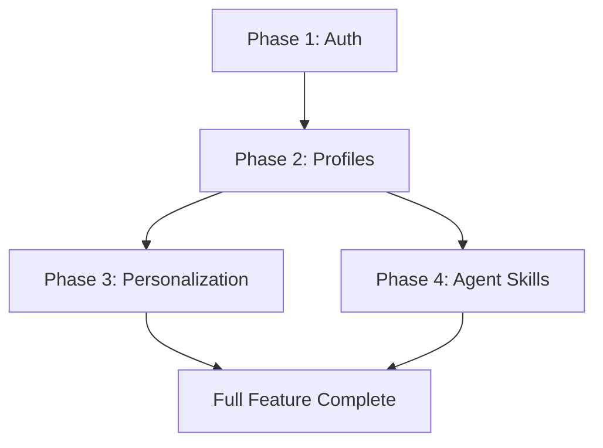

# Implementation Plan: Intelligent Personalization & Authentication

**Branch**: `intelligent-personalization-auth` | **Date**: 2025-12-09 | **Spec**: [spec.md](./spec.md)
**Input**: Feature specification from `/specs/intelligent-personalization-auth/spec.md`

## Summary

Implement a three-tier feature set for the Physical AI & Humanoid Robotics book:
1. **Better Auth** integration for user authentication (email/password)
2. **User Profile System** with background questionnaire and expertise tracking
3. **Content Personalization** using Gemini API to adapt chapter content based on user profiles
4. **Agent Skills** for reusable AI-powered content interactions

## Technical Context

**Language/Version**: Python 3.13 (backend), TypeScript 5.6 (frontend)
**Primary Dependencies**:
- Backend: FastAPI, SQLAlchemy, asyncpg, google-generativeai
- Frontend: React 18, Docusaurus 3.5, better-auth (new)
**Storage**: Neon Serverless Postgres (existing), localStorage (client cache)
**Testing**: pytest (backend), manual testing (frontend - no existing test infra)
**Target Platform**: Web (Docusaurus static site + FastAPI backend)
**Project Type**: Web application (frontend + backend)
**Performance Goals**:
- Auth operations: <500ms
- Personalization: <30s (new), <10s (cached)
- Agent Skills: <5s response
**Constraints**:
- Free tier limits (Neon: 0.5GB, Qdrant: 1GB)
- Gemini API rate limits (15 RPM free tier)
- No OAuth initially (email/password only)
**Scale/Scope**: Single user sessions, ~20 chapters, ~5 concurrent users

## Constitution Check

*GATE: Must pass before Phase 0 research. Re-check after Phase 1 design.*

| Principle | Status | Notes |
|-----------|--------|-------|
| I. Accuracy and Reliability | ✅ PASS | Personalization uses LLM but preserves code blocks/diagrams |
| II. Modular, Spec-Driven Development | ✅ PASS | Spec created, plan in progress |
| III. Maintainability and Clarity | ✅ PASS | Clear separation: auth service, profile service, personalization service |
| IV. End-to-End Consistency | ✅ PASS | Same patterns as existing translation/chatbot services |
| V. Security and Privacy | ✅ PASS | Better Auth handles password hashing, session management |

**Key Standards Compliance:**
- Free tier compatible: ✅ (Better Auth is MIT licensed, uses existing Postgres)
- Zero broken links: ✅ (no new routes that could break)
- API Standards: ✅ (follows existing FastAPI patterns)

## Project Structure

### Documentation (this feature)

```text
specs/intelligent-personalization-auth/
├── plan.md              # This file
├── research.md          # Phase 0 output
├── data-model.md        # Phase 1 output
├── quickstart.md        # Phase 1 output
├── contracts/           # Phase 1 output
│   └── api-openapi.yaml
└── tasks.md             # Phase 2 output (from /sp.tasks)
```

### Source Code (repository root)

```text
backend/
├── src/
│   ├── models/
│   │   ├── database.py        # Existing - ADD: User, UserProfile tables
│   │   ├── auth.py            # NEW: Auth-related Pydantic models
│   │   └── personalization.py # NEW: Personalization models
│   ├── services/
│   │   ├── auth_service.py         # NEW: Better Auth integration wrapper
│   │   ├── profile_service.py      # NEW: User profile management
│   │   ├── personalization_service.py # NEW: Content personalization
│   │   └── skills_service.py       # NEW: Agent Skills registry
│   └── api/
│       ├── auth_routes.py          # NEW: /api/auth/* endpoints
│       ├── profile_routes.py       # NEW: /api/profile/* endpoints
│       └── personalization_routes.py # NEW: /api/personalize/* endpoints
└── tests/
    └── unit/
        └── test_personalization.py # NEW

src/
├── components/
│   ├── Auth/                    # NEW
│   │   ├── AuthProvider.tsx     # Better Auth context
│   │   ├── SignInModal.tsx      # Sign in form
│   │   ├── SignUpModal.tsx      # Sign up form
│   │   └── BackgroundQuestionnaire.tsx # Onboarding
│   ├── Personalization/         # NEW
│   │   ├── PersonalizeButton.tsx    # Toggle button
│   │   └── PersonalizedContent.tsx  # Content wrapper
│   └── AgentSkills/             # NEW
│       ├── SkillsPanel.tsx      # Skills interface
│       └── CodeExplainer.tsx    # Code explanation overlay
└── theme/
    └── Root.tsx                 # MODIFY: Add AuthProvider wrapper
```

**Structure Decision**: Web application pattern with separated frontend/backend. Auth is handled client-side with Better Auth, backend provides profile storage and personalization API.

## Architecture Decisions

### AD-1: Better Auth vs Custom Auth
**Decision**: Use Better Auth library for frontend authentication
**Rationale**:
- Framework-agnostic, works with React
- Built-in session management and cookie handling
- No backend auth server needed (stateless JWT approach)
- TypeScript-first with excellent DX

### AD-2: Personalization Strategy
**Decision**: Full chapter rewrite via Gemini API with caching
**Rationale**:
- Simpler than per-paragraph adaptation
- Can leverage existing Gemini service
- Cache by (chapter_id, profile_hash) to reduce API calls
- User can toggle between original and personalized

### AD-3: Profile Storage
**Decision**: Store profiles in existing Neon Postgres
**Rationale**:
- Already configured and connected
- Simpler than adding new database
- Profile data is small (<1KB per user)

### AD-4: Agent Skills Implementation
**Decision**: Start with prompt engineering, not Claude Agent SDK
**Rationale**:
- Claude Agent SDK adds complexity
- Gemini API already integrated
- Can achieve 80% of value with well-crafted prompts
- Upgrade path to SDK exists if needed

## Complexity Tracking

> No constitution violations - no tracking needed.

## Implementation Phases

### Phase 1: Authentication (P1 User Story)
1. Install Better Auth (`better-auth`, `@better-auth/react`)
2. Create AuthProvider wrapper component
3. Create SignIn/SignUp modal components
4. Add User table to Postgres schema
5. Create auth_routes.py for token validation
6. Add auth state persistence to localStorage

### Phase 2: User Profiles (P1 User Story continued)
1. Create UserProfile table in Postgres
2. Create BackgroundQuestionnaire component
3. Implement profile_service.py
4. Add profile_routes.py endpoints
5. Store expertise level, languages, goals

### Phase 3: Content Personalization (P2 User Story)
1. Create PersonalizeButton component
2. Implement personalization_service.py with Gemini
3. Add caching layer for personalized content
4. Create PersonalizedContent wrapper
5. Add toggle between original/personalized

### Phase 4: Agent Skills (P3, P4 User Stories)
1. Define skill prompt templates
2. Create SkillsPanel component
3. Implement code-explainer skill
4. Implement concept-simplifier skill
5. Implement prerequisite-finder skill

## Risk Analysis

| Risk | Impact | Mitigation |
|------|--------|------------|
| Gemini rate limits during personalization | High | Cache aggressively, queue requests |
| Better Auth learning curve | Medium | Start with email/password only |
| Personalization quality varies | Medium | Preserve code blocks, user feedback |
| Session management complexity | Low | Use Better Auth's built-in session handling |

## Dependencies


