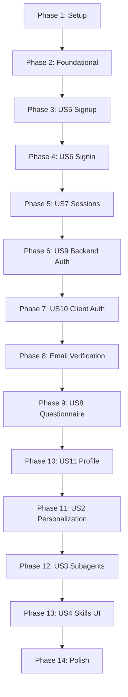

# Tasks: Intelligent Personalization & Authentication

**Input**: Design documents from `/specs/intelligent-personalization-auth/`
**Prerequisites**: plan.md ✓, spec.md ✓, research.md ✓, data-model.md ✓, contracts/ ✓, quickstart.md ✓
**Generated**: 2025-12-12 (Updated with BetterAuth clarifications)
**Tests**: Not explicitly requested - excluded from task list

**Organization**: Tasks grouped by user story to enable independent implementation and testing.

## Key Clarifications Applied
- **FR-025**: Password policy - minimum 8 characters, no complexity requirements
- **FR-026**: Email verification required before accessing personalization features
- **FR-027**: BetterAuth runs client-side in Docusaurus; FastAPI validates session cookies directly

## Format: `[ID] [P?] [Story] Description`

- **[P]**: Can run in parallel (different files, no dependencies)
- **[Story]**: Which user story this task belongs to (US5-US11, US2-US4 from spec)
- Include exact file paths in descriptions

## Path Conventions (Web App)

- **Backend**: `backend/src/` (FastAPI)
- **Frontend**: `src/` (Docusaurus/React)

---

## Phase 1: Setup (Shared Infrastructure)

**Purpose**: Project initialization and dependency installation

- [x] T001 Install BetterAuth dependencies: `npm install better-auth @better-auth/react`
- [x] T002 [P] Install backend dependencies: add `bcrypt` to backend/requirements.txt
- [x] T003 [P] Add BetterAuth environment variables to backend/.env.example (BETTER_AUTH_SECRET, SESSION_EXPIRES_IN, SESSION_UPDATE_AGE, EMAIL_VERIFICATION_REQUIRED)
- [x] T004 [P] Add frontend environment variables to .env.example (VITE_BETTER_AUTH_URL, VITE_API_URL)
- [x] T005 Create BetterAuth client configuration in src/lib/auth-client.ts with password policy (min 8 chars)

---

## Phase 2: Foundational (Blocking Prerequisites)

**Purpose**: Core infrastructure that MUST be complete before ANY user story can be implemented

**⚠️ CRITICAL**: No user story work can begin until this phase is complete

- [x] T006 Add User SQLAlchemy model with email_verified, verification_token, verification_expires fields in backend/src/models/database.py
- [x] T007 [P] Add UserProfile SQLAlchemy model in backend/src/models/database.py
- [x] T008 [P] Add PersonalizedContent SQLAlchemy model in backend/src/models/database.py
- [x] T009 [P] Add SkillInvocation SQLAlchemy model in backend/src/models/database.py
- [x] T010 Create database migration script backend/src/migrations/001_auth_personalization.sql
- [x] T011 Run database migration against Neon Postgres
- [x] T012 Create BetterAuth session validator middleware in backend/src/services/session_validator.py
- [x] T013 [P] Create auth Pydantic models (SignUpRequest, SignInRequest, AuthResponse, SessionInfo) in backend/src/models/auth.py
- [x] T014 [P] Create profile Pydantic models (UserProfileRequest, UserProfileResponse, QuestionnaireRequest) in backend/src/models/auth.py
- [x] T015 [P] Create personalization Pydantic models (PersonalizeRequest, PersonalizeResponse, SkillRequest, SkillResponse) in backend/src/models/personalization.py
- [x] T016 Add CORS middleware for localhost:3000 in backend/src/main.py
- [x] T017 Register auth, profile, personalization routes in backend/src/main.py

**Checkpoint**: Foundation ready - user story implementation can now begin

---

## Phase 3: User Story 5 - BetterAuth Email/Password Signup Flow (Priority: P1-A) 🎯 MVP

**Goal**: New users can create accounts using email/password with BetterAuth

**Independent Test**: Submit signup form, verify session cookie created, user record in database, verification email sent

### Implementation for User Story 5

- [x] T018 [P] [US5] Create SignUpModal component in src/components/Auth/SignUpModal.tsx
- [x] T019 [P] [US5] Create password validation utility (min 8 chars per FR-025) in src/lib/validators.ts
- [x] T020 [US5] Implement signUp.email flow in SignUpModal using BetterAuth client
- [x] T021 [US5] Add POST /api/auth/signup endpoint in backend/src/api/auth_routes.py
- [x] T022 [US5] Implement user creation with bcrypt password hashing in backend/src/services/auth_service.py
- [x] T023 [US5] Add email uniqueness validation with non-enumerable error response
- [x] T024 [US5] Generate verification token and send verification email on signup
- [ ] T025 [US5] Create session cookie with compact encoding on successful signup

**Checkpoint**: Users can sign up, receive verification email

---

## Phase 4: User Story 6 - BetterAuth Signin Flow (Priority: P1-B)

**Goal**: Returning users can sign in with email/password

**Independent Test**: Sign in with valid credentials, verify session cookie created, profile loaded

### Implementation for User Story 6

- [x] T026 [P] [US6] Create SignInModal component in src/components/Auth/SignInModal.tsx
- [x] T027 [US6] Implement signIn.email flow with rememberMe option in SignInModal
- [x] T028 [US6] Add POST /api/auth/signin endpoint in backend/src/api/auth_routes.py
- [x] T029 [US6] Implement credential validation in auth_service.py
- [x] T030 [US6] Return generic "Invalid credentials" error (no email enumeration per FR-024)
- [ ] T031 [US6] Set session cookie with security flags (httpOnly, secure in prod, sameSite)

**Checkpoint**: Users can sign in, session persists across page loads

---

## Phase 5: User Story 7 - Secure Session Handling (Priority: P1-C)

**Goal**: Sessions managed securely with automatic refresh and proper expiration

**Independent Test**: Create session, verify cookie properties, check refresh at updateAge (1 day), confirm expiration at expiresIn (7 days)

### Implementation for User Story 7

- [x] T032 [US7] Configure BetterAuth session settings (expiresIn: 7 days, updateAge: 1 day) in src/lib/auth-client.ts
- [x] T033 [US7] Enable cookie caching with compact encoding strategy
- [x] T034 [US7] Implement session refresh logic in session_validator.py
- [x] T035 [US7] Add POST /api/auth/signout endpoint in backend/src/api/auth_routes.py
- [x] T036 [US7] Implement session revocation in auth_service.py
- [x] T037 [P] [US7] Add GET /api/auth/sessions endpoint to list active sessions (FR-021)
- [x] T038 [P] [US7] Add DELETE /api/auth/sessions/{sessionId} endpoint to revoke sessions

**Checkpoint**: Sessions refresh automatically, signout works correctly

---

## Phase 6: User Story 9 - Backend BetterAuth Integration (Priority: P1-D)

**Goal**: FastAPI validates BetterAuth session cookies for protected endpoints (FR-027)

**Independent Test**: Make authenticated request, verify session validation, test 401 for invalid sessions

### Implementation for User Story 9

- [x] T039 [US9] Create get_session dependency using session_validator in backend/src/services/session_validator.py
- [x] T040 [US9] Create require_verified_email dependency checking emailVerified status (FR-026)
- [x] T041 [US9] Add GET /api/auth/me endpoint returning current user info in auth_routes.py
- [x] T042 [US9] Implement 401 Unauthorized responses for invalid/expired sessions
- [ ] T043 [US9] Add request logging for authentication attempts

**Checkpoint**: All protected endpoints correctly validate sessions

---

## Phase 7: User Story 10 - Client-Side BetterAuth SDK Integration (Priority: P1-E)

**Goal**: React components have reactive auth state via useSession hook (FR-018)

**Independent Test**: Verify useSession updates on signin/signout, protected routes redirect correctly

### Implementation for User Story 10

- [x] T044 [P] [US10] Create AuthProvider wrapper component in src/components/Auth/AuthProvider.tsx
- [x] T045 [US10] Implement useSession hook integration in AuthProvider
- [x] T046 [US10] Modify src/theme/Root.tsx to wrap app with AuthProvider
- [x] T047 [P] [US10] Create useAuth hook exposing signIn, signUp, signOut methods in src/hooks/useAuth.ts
- [x] T048 [US10] Add auth status to navbar (login/signup or user menu) in src/components/Auth/AuthStatus.tsx
- [ ] T049 [US10] Implement protected route redirect logic for unauthenticated users

**Checkpoint**: Auth state is reactive across all components

---

## Phase 8: Email Verification (FR-026)

**Goal**: Email verification required before accessing personalization features

**Independent Test**: Signup, click verification link, confirm email_verified=true, access personalization

### Implementation for Email Verification

- [x] T050 [P] Create email verification page in src/pages/verify-email.tsx
- [x] T051 Add POST /api/auth/verify-email endpoint in backend/src/api/auth_routes.py
- [x] T052 Implement verification token validation in auth_service.py
- [x] T053 [P] Add POST /api/auth/resend-verification endpoint
- [x] T054 Create VerifyEmailPrompt component for unverified users in src/components/Auth/VerifyEmailPrompt.tsx
- [x] T055 Add email_verified gate to personalization endpoints using require_verified_email dependency

**Checkpoint**: Email verification flow complete, personalization blocked for unverified users

---

## Phase 9: User Story 8 - Structured Background Questions During Signup (Priority: P2-A)

**Goal**: New users complete background questionnaire after signup (FR-002, FR-020)

**Independent Test**: Complete signup, see questionnaire, submit responses, verify profile created

### Implementation for User Story 8

- [x] T056 [P] [US8] Create BackgroundQuestionnaire component in src/components/Auth/BackgroundQuestionnaire.tsx
- [x] T057 [US8] Implement questionnaire form with 3-5 questions (expertise, languages, goals)
- [x] T058 [US8] Add BetterAuth onSuccess callback to redirect to questionnaire after signup (FR-020)
- [x] T059 [US8] Create profile_service.py in backend/src/services/profile_service.py
- [x] T060 [US8] Add POST /api/profile/questionnaire endpoint in backend/src/api/profile_routes.py
- [x] T061 [US8] Implement questionnaire response storage with JSONB
- [x] T062 [US8] Create "Complete Profile" prompt for users who skipped questionnaire (FR-003)

**Checkpoint**: Users can complete questionnaire, profile data persisted

---

## Phase 10: User Story 11 - User Profile Handling Post-Authentication (Priority: P2-B)

**Goal**: Users can view and update their profile information (FR-023)

**Independent Test**: Load profile page, verify data display, update expertise, confirm persistence

### Implementation for User Story 11

- [x] T063 [P] [US11] Create ProfilePage component in src/pages/profile.tsx
- [x] T064 [US11] Implement profile data display (name, email, expertise, languages)
- [x] T065 [US11] Add GET /api/profile endpoint in backend/src/api/profile_routes.py
- [x] T066 [US11] Add PUT /api/profile endpoint for profile updates
- [x] T067 [US11] Implement profile update logic in profile_service.py
- [x] T068 [P] [US11] Create ProfileEditForm component in src/components/Profile/ProfileEditForm.tsx
- [x] T069 [US11] Add password change functionality via BetterAuth

**Checkpoint**: Users can view and edit their profiles

---

## Phase 11: User Story 2 - Personalize Chapter Content Button (Priority: P2)

**Goal**: Logged-in users can personalize chapter content (FR-005, FR-006)

**Independent Test**: Login as beginner (verified email), click "Personalize Content", verify simplified content

### Implementation for User Story 2

- [x] T070 [P] [US2] Create PersonalizeButton component in src/components/Personalization/PersonalizeButton.tsx
- [x] T071 [P] [US2] Create PersonalizedContent wrapper in src/components/Personalization/PersonalizedContent.tsx
- [x] T072 [US2] Create personalization_service.py in backend/src/services/personalization_service.py
- [x] T073 [US2] Implement Gemini API integration for content personalization (FR-006)
- [x] T074 [US2] Add POST /api/personalize/chapter endpoint in backend/src/api/personalization_routes.py
- [x] T075 [US2] Implement profile-based personalization prompt (beginner/intermediate/expert)
- [x] T076 [US2] Add content caching by (chapter_id, profile_hash) per FR-007
- [x] T077 [US2] Add GET /api/personalize/status/{chapterId} endpoint for cache status
- [x] T078 [US2] Implement "Show Original" toggle in PersonalizedContent (FR-008)
- [ ] T079 [US2] Add rate limiting (5 req/min per user) per FR-012
- [x] T080 [US2] Preserve code blocks and diagrams during personalization (FR-009)
- [x] T081 [US2] Add PersonalizeButton to DocPage layout in src/theme/DocItem/Layout/index.tsx

**Checkpoint**: Content personalization works based on user profile (email verified required)

---

## Phase 12: User Story 3 - Claude Code Subagent Integration (Priority: P3)

**Goal**: AI agents provide contextual help and personalized guidance (FR-010)

**Independent Test**: Open chatbot, ask code question, verify context-aware response using user profile

### Implementation for User Story 3

- [ ] T082 [US3] Extend chatbot service to include user profile context in backend/src/services/chatbot_service.py
- [ ] T083 [US3] Add personalized prompt templates based on expertise level
- [ ] T084 [US3] Implement chapter context injection for code explanations
- [ ] T085 [US3] Add Python comparison prompts for users with Python background
- [ ] T086 [US3] Update ChatbotWidget to pass user profile to API in src/components/ChatbotWidget/ChatbotWidget.tsx
- [ ] T087 [P] [US3] Add "Explain this code" quick action to chatbot in src/components/ChatbotWidget/QuickActions.tsx
- [ ] T088 [P] [US3] Add "Generate practice exercises" quick action

**Checkpoint**: Chatbot provides personalized responses based on user expertise

---

## Phase 13: User Story 4 - Agent Skills for Reusable Intelligence (Priority: P4)

**Goal**: Users can invoke skills via UI (FR-011)

**Independent Test**: Hover code block, click "Explain", verify skill response

### Implementation for User Story 4

- [ ] T089 [US4] Create skills_service.py with skill registry in backend/src/services/skills_service.py
- [ ] T090 [US4] Implement code-explainer skill prompt template
- [ ] T091 [US4] Implement concept-simplifier skill prompt template
- [ ] T092 [US4] Implement prerequisite-finder skill prompt template
- [ ] T093 [US4] Add GET /api/skills endpoint to list available skills
- [ ] T094 [US4] Add POST /api/skills/invoke endpoint for skill execution
- [ ] T095 [US4] Log skill invocations to skill_invocations table
- [ ] T096 [P] [US4] Create SkillsPanel component in src/components/AgentSkills/SkillsPanel.tsx
- [ ] T097 [P] [US4] Create CodeExplainer overlay in src/components/AgentSkills/CodeExplainer.tsx
- [ ] T098 [US4] Add code block hover interaction to trigger "Explain" skill
- [ ] T099 [US4] Implement text selection "Simplify" action
- [ ] T100 [US4] Create "What should I know first?" chapter-level skill trigger
- [ ] T101 [US4] Display skill responses in floating panel/modal

**Checkpoint**: All three skills accessible via UI interactions

---

## Phase 14: Polish & Cross-Cutting Concerns

**Purpose**: Improvements that affect multiple user stories

- [ ] T102 [P] Add comprehensive error handling across all auth routes
- [ ] T103 [P] Add structured logging for auth, profile, and personalization services
- [ ] T104 [P] Update .env.example with all required environment variables
- [ ] T105 Implement graceful degradation when BetterAuth/Gemini unavailable
- [ ] T106 [P] Add CSRF protection for auth endpoints
- [ ] T107 Security review: verify no credential enumeration, proper cookie flags (SC-014)
- [ ] T108 [P] Update quickstart.md with final setup instructions
- [ ] T109 Run full integration test of signup → verify email → questionnaire → personalization flow
- [ ] T110 Performance validation: <50ms session validation (SC-009), <30s personalization (SC-002)

---

## Dependencies & Execution Order

### Phase Dependencies



### User Story Dependencies

- **US5 (Signup)**: Foundational only - No story dependencies
- **US6 (Signin)**: Depends on US5 (users must exist)
- **US7 (Sessions)**: Depends on US5, US6 (auth flow must work)
- **US9 (Backend Auth)**: Depends on US7 (session handling)
- **US10 (Client Auth)**: Depends on US9 (backend validation)
- **Email Verification**: Depends on US5 (signup sends verification)
- **US8 (Questionnaire)**: Depends on US5, Email Verification
- **US11 (Profile)**: Depends on US8 (profile data exists)
- **US2 (Personalization)**: Depends on US11, Email Verification (gated)
- **US3 (Subagents)**: Depends on US11 (needs profile context)
- **US4 (Skills UI)**: Depends on US3 (skill backend)

### Parallel Opportunities

**Within Phase 2 (Foundational)**:
```bash
# Models can be created in parallel:
Task T007: "Add UserProfile model"
Task T008: "Add PersonalizedContent model"
Task T009: "Add SkillInvocation model"
Task T013: "Create auth Pydantic models"
Task T014: "Create profile Pydantic models"
Task T015: "Create personalization Pydantic models"
```

**Within Phase 11 (US2 Personalization)**:
```bash
# Components can be created in parallel:
Task T070: "Create PersonalizeButton component"
Task T071: "Create PersonalizedContent wrapper"
```

---

## Implementation Strategy

### MVP First (Phases 1-8: Core Auth + Email Verification)

1. Complete Phase 1: Setup
2. Complete Phase 2: Foundational (CRITICAL)
3. Complete Phases 3-7: Core Authentication (US5, US6, US7, US9, US10)
4. Complete Phase 8: Email Verification
5. **STOP and VALIDATE**: Users can sign up, verify email, sign in
6. Deploy/demo basic auth with email verification

### Incremental Delivery

1. **Auth MVP** (Phases 1-8): Signup/signin + email verification → Test → Deploy
2. **Profiles** (Phases 9-10): Questionnaire + profile management → Test → Deploy
3. **Personalization** (Phase 11): Content adaptation → Test → Deploy
4. **AI Skills** (Phases 12-13): Agent skills → Test → Deploy
5. **Polish** (Phase 14): Finalize → Test → Release

---

## Summary

| Phase | User Story | Tasks | Parallel Tasks |
|-------|-----------|-------|----------------|
| 1 | Setup | 5 | 3 |
| 2 | Foundational | 12 | 6 |
| 3 | US5 - Signup | 8 | 2 |
| 4 | US6 - Signin | 6 | 1 |
| 5 | US7 - Sessions | 7 | 2 |
| 6 | US9 - Backend Auth | 5 | 0 |
| 7 | US10 - Client Auth | 6 | 2 |
| 8 | Email Verification | 6 | 2 |
| 9 | US8 - Questionnaire | 7 | 1 |
| 10 | US11 - Profile | 7 | 2 |
| 11 | US2 - Personalization | 12 | 2 |
| 12 | US3 - Subagents | 7 | 2 |
| 13 | US4 - Skills UI | 13 | 2 |
| 14 | Polish | 9 | 5 |
| **Total** | | **110** | **32** |

**MVP Scope**: Phases 1-8 (55 tasks) - Full auth with email verification
**Parallel Opportunities**: 32 tasks marked with [P]

---

## Notes

- [P] tasks = different files, no dependencies
- [Story] label maps task to specific user story for traceability
- Each user story checkpoint validates independent functionality
- Commit after each task or logical group
- Email verification (FR-026) gates personalization access
- Password policy (FR-025): minimum 8 characters, no complexity
- BetterAuth runs client-side; FastAPI validates cookies with shared secret (FR-027)
- Session config: expiresIn 7 days, updateAge 1 day, compact encoding (FR-016, FR-017)
